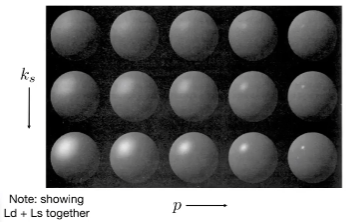
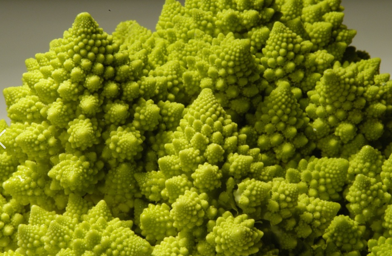

# 《games101》 课程笔记

- `2024-09-15` 考虑到这部分的学习与我要做的工作有比较强的相关性，因此将 《games101》课程笔记从私有日志迁移到公开日志。
- 随便记点笔记，能看就行，总共 22 节课。
  - games101 https://www.bilibili.com/video/BV1X7411F744 总共 22 节课
  - `2024-05-28` 学习 games101 P1
  - `2024-05-28` 学习 games101 P2
  - `2024-05-30` 学习 games101 P3
  - `2024-05-31` 学习 games101 P4
  - `2024-06-02` 学习 games101 P5
  - `2024-06-07` 学习 games101 P6
  - `2024-06-11` 学习 games101 P7
  - `2024-06-11` 学习 games101 P8
  - `2024-06-12` 学习 games101 P9
  - `2024-06-12` 学习 games101 P10
  - `2024-07-05` 学习 games101 P11 [SHOW] GAMES101
  - `2024-07-06` 学习 games101 P12 [SHOW] GAMES101
  - `2024-09-15` 学习 games101 P13 [SHOW] GAMES101
- [SLINK] [RED] games101 完成进度 13/22

## P1 为什么要学习图形学

- 众多现代图形学应用——略
- 图形学酷毙了（Awesome）

### 课程安排：4/4

- 光栅化：将三维空间的几何形体显示在屏幕上
  - 实时：能做到 30 fps 的叫实时
- 曲线和曲面：如何表示几何曲面，贝塞尔曲线
- 光线追踪：慢，能够生成非常真实的画面，适用于电影生成
  - trade of：权衡渲染效果与渲染用时，两全其美做法：实时光线追踪
- 动画/仿真：物理引擎，关键帧动画

### 不说什么

- 不介绍 OpenGL，DirectX，Vulkan 等 API
  - 形而下者谓之器，形而上者谓之道
- 三维建模游戏开发工具
  - Maya/3DS MAX/Blender
  - Unity/UE
- 计算机视觉，语义分割，深度学习
  - 如何界定图形学和计算机视觉：需要猜测、理解语义的是计算机视觉
  - 模型 -> 模型：计算机图形学/仿真
  - 图像 -> 图像：计算机视觉/图像处理
  - 模型  -> 图像：计算机图形学/渲染
  - 图像 -> 模型：计算机视觉

### 具体细节

- 不需要买显卡（我知道你要打游戏，骗家长上课要用）
- 课程网站 https://sites.cs.ucsb.edu/~lingqi/teaching/games101.html
- 阅读材料：《虎书》Fundamentals of Computer Graphics **第三版**即可
- 论坛平台 http://games-cn.org

### 作业

- 大多数作业提供虚拟机镜像和代码框架
- 每周任务量不超过 20 行代码，语言强制要求用 C++，提供函数库
- 理由：实践中工业界最常用的图形学相关编程语言仍然是 C++
- **务必使用 IDE**：
  - 代码补全，语义提示，成员函数的使用方法，用 VSC 就行
  - **不推荐的 IDE**：CLion，Eclipse
  - 不是 IDE：Notepad++，Subline Text，Vim，Emacs

## P2 线性代数复习

- 阅读材料：《虎书》第二章（Miscellaneous Math），第五章（Linear Algebra）

### 图形学前置依赖

- 数学基础：线性代数，微积分，统计学
- 物理学基础：光学，力学
- 杂项：信号处理（反走样），数值分析（有限元，数值积分）
- 审美

### 变换与矩阵乘法

- 使用矩阵乘法可以表示空间中点的平移和旋转

- 使用单位向量表示图形学中的方向，向量默认是列向量

- dual matrix of vector

  - $$
    \vec a\times \vec b=A\times \vec b=
    \begin{pmatrix}
    0 & -z_a & y_a\\
    z_a & 0 & -x_a\\
    -y_a & x_a & 0
    \end{pmatrix}
    \begin{pmatrix}
    x_b\\
    y_b\\
    z_b
    \end{pmatrix}
    $$

- homogeneous coordinates：齐次坐标

## P3-4 变换

### 原始坐标

- 两种变换：模型变换，视图变化
- 缩放变换：$S_p$ 各个维度坐标均乘以一个系数，可能均匀可能不均匀
- 对称变换：把某一维或某几维坐标取相反数
- 切变变换：把某一维坐标的若干倍加到另一维坐标上
- 旋转变换：$R_{\theta}$ 绕原点逆时针旋转，**旋转矩阵是一个正交矩阵**
- 线性变换：可以使用矩阵乘法描述的变换

### 齐次坐标

- 为什么要引入其次坐标：原始坐标下平移变换无法表示成矩阵乘法的形式
  - 点的齐次坐标补充一维 1，向量的齐次坐标补充一维 0
  - 齐次坐标下，两个点的加和就是这两个点的中点
  - 所有放射变换都可以写成齐次坐标的线性变换
- 平移变换

### 复合变换

- 如果一个变换可以写成矩阵乘法，那它的逆变换可以使用矩阵的逆矩阵得到
- 绕指定点旋转：先将旋转轴平移到原点，再旋转，再逆向平移
- 矩阵表示的好处：符合变换可以直接使用矩阵乘法计算出对应的矩阵

### 三维变换

- 仍然是齐次坐标，坐标之和相当于取坐标的中点
- 相当于先对前三维进行线性变换，再对得到的结果进行平移
- 三维意义下的绕轴旋转：$R_x(\theta), R_y(\theta), R_z(\theta)$
  - 欧拉角: roll(平滚), pitch(俯仰), yaw(转向)
  - Rodrigue's Rotation Formula:
    - $R(n, \alpha)=\cos(\alpha) I + (1-cos(\alpha))nn^T+\sin(\alpha)N$
    - 其中 $N=\begin{pmatrix}0&-n_z&n_y\\n_z&0&-n_x\\-n_y&n_x&0\end{pmatrix}$
    - 矩阵 $N$ 就是向量 $n$ 的叉乘矩阵化
  - 四元数：解决旋转的正确插值问题：旋转矩阵难以直观地插值

### 观测变换

将三维空间中的坐标变化为二维空间地方法：模型变换、视图变换、投影变换（MVP 变换）。

- 视图变换：根据相机的朝向与位置来变换三维空间的点
  - 本质上就是换坐标系
  - 相机有位置、朝向、上方向
  - 保证相机位置永远在原点，Y 方向永远向上，朝向 -Z 方向
  - 将指定方向旋转到 X 轴不好求，但是把 X 轴旋转到一个指定方向是好写的，**可以利用逆矩阵（转置）求得**
- 投影变换
  - 正交投影（平行投影）：平行的线仍然平行，**没有近大远小现象**
    - 直接扔掉 $z$ 轴即可得到投影结果
    - 正式做法：
      - 在空间中选择一个立方体，将其移动到正则立方体 $[-1, 1]^3$
      - 先平移后缩放
      - $z$ 越小离我们越远，$z$ 越大离我们越近 
  - 透视投影：所有平行线相较于灭点，**有近大远小现象**
    - 相机趋近于无穷远时，透视投影趋近于正交投影
    - 先将坐标 $/z$ 再扔掉 $z$ 轴坐标
    - 正式做法：
      - 在空间中选择一个 Frustum 将其变换到 $[-1, 1]^3$
      - 相当于先把 Frustum 做成 Cuboid 再做平行投影
      - 在考虑 $z$ 值的变化时，我们希望近平面和远平面的 $z$ 坐标不变
      - $M=\begin{pmatrix}n&0&0&0\\0&n&0&0\\0&0&n+f&-nf\\0&0&1&0\end{pmatrix}$
      - 思考: 对于两个裁剪面中间的点的 $z$ 值在透视变换后变小还是变大
        -  更远离观测点

- 视口变换：将来再说

## P5 三角形光栅化

- 通过透视变换将透视投影变换为正交投影
  - 长宽比：近裁剪面的长宽比例
  - fovY：field of view Y：垂直可视角度
- 什么是屏幕：像素构成的二维数组，一种光栅成像数据
  - Raster == screen in German
  - 像素：目前暂且理解为不可再分的最小显示单元，RGB 色光合成
  - 屏幕坐标系：使用整数坐标描述像素在屏幕上的位置
- 视口变换 $M=\begin{pmatrix}\frac W 2&0&0&\frac W 2\\0&\frac H 2&0&\frac H 2\\0&0&1&0\\0&0&0&1\end{pmatrix}$
- 一些绘图机器：
  - CNC Sharpie Drawing Machine，Laser Cutter，示波器
  - Oscilloscope Art，阴极射线管（光栅扫描/隔行扫描）
  - 隔行扫描容易造成画面撕裂
  - 现代显示器：帧缓冲， LCD（液晶旋光性），OLED，Electrophoretic
- 为什么片元使用三角形
  - 内部一定是平面的，凸集，可以组成任何多边形
- 采样：最简单的三角形光栅化方法
  - 通过采样点取值决定像素颜色，连续函数的一种离散化方法
    - 判断像素中心是否在三角形内，从而实现光栅化
    - 使用叉积判断点是否在三角形内（上左下右规则）
    - 只需要判断轴向包围盒（AABB）中的每个像素是否在三角形内即可
    - 扫描线光栅化：适用于实际面积远小于 AABB 的情况
  - 像素的分布情况：
    - 默认排布
    - 拜尔排布（绿色多于红色和蓝色，类似于相机）
    - 打印机常用的像素排布
  - 抗锯齿/反走样

## P6 光栅化抗锯齿

- 主要介绍抗锯齿 (anti aliasing)，希望同学们有数字信号处理的基础

### 采样带来的问题

- 使用离散函数近似描述连续函数的方法：空间位置的采样，时间轴上的采样
- sampling artifacts：采样瑕疵：例如：锯齿、摩尔纹、Wagon Wheel 幻觉等
- 走样：采样的速度跟不上信号变化的速度（可能是时间上的，也可能是空间上的）

### 反走样

- 在采样前模糊：先对原始图像进行模糊（滤波），然后再对模糊后的图形进行空间采样
- 能不能先采样在模糊：不行！为什么？

### 频域分析

- $f(x)=\cos(2\pi f x)$ 频率不同的余弦波，周期 $T=\frac 1 f$
- 傅里叶级数 $f(x)=a_0+\sum_{n=0}^{\infty}(a_n\sin(nx) + b_n\cos(nx))$
- 傅里叶变换与逆变换：时域到频域
- 采样定理：采样频率至少要等于信号变换频率的二倍，才能恢复出原始信号
- 采样频率不足会将一个高频信号误认为是一个低频信号

### 滤波（数字信号处理）

- 删除特定频率的信号
  - 高通滤波：只保留高频信息（对应到图像上的边界）
  - 低通滤波（类似于平均）：只保留低频信息（对应到图片上的色块）
  - 带通滤波：保留一个频率区间的信息
  - `2024-06-07` 想到可以做一个 bad-apple 的高通滤波效果程序

- 滤波=平均=卷积

  - 卷积：滑动窗口与原始信号进行逐个位置的点乘积
  - 数学上不是这么定义的，但是图形学中可以这么定义
  - 盒子变大，频域上反而变小；盒子变小，频域上反而变大
  - **时域上的卷积等价于对频域上进行点乘积**

- 采样=重复频率上的内容

  - 冲激函数（脉冲函数）的叠加
  - 采样就是在重复一个原始信号的频谱
  - 走样：原始信号频谱在被重复时发生了混叠

- 如何反走样

  - 增加采样率：换一个分辨率更高的显示器
  - 先模糊再采样：由于模糊的过程可以去除高频信号，因此可以放置混叠

  - 使用何种滤波器实现模糊：使用低通滤波器卷积即可

### MSAA（多重采样反走样）

- 由于我们难以算出实际上某个像素中颜色的积分均值
  - 所以可以考虑多重采样的思路去计算每个像素内的颜色的近似积分均值
  - 因此 MSAA 不能在严格意义上解决抗锯齿问题
  - 另外 MSAA 并没有提高分辨率，没有提高实际采样率
- 引入 MSAA 的代价：理论上 $n\times$MSAA 增大了 $n^2$ 倍计算量
  - 实际上 subpixel 也不一定要均匀选取
  - 可以按照特定图案选取以方便对 subpixel 的复用，减少计算量
  - 有一定随机性地选取

### 其他抗锯齿方法

- FXAA：快速近似抗锯齿：分析出锯齿边界，并将其替换成无锯齿的图像
- TAA（基于时间的抗锯齿算法）：
  - 将每一帧中不做多重采样，但是采样点位置会随时间浮动
  - 可以应用上一帧的采样结论来优化下一帧的采样效果
- DLSS（DL Super Sampling/Resolusion）：深度学习超分辨率
  - 根据经验猜测，用于提升图像的分辨率

## P7 z 缓冲、光照与着色

- 抗锯齿要先模糊再采样，而不能先采样再模糊。

### z 缓冲/深度缓冲

- 受到**油画**的启发：画家算法，先画远处的物品，再画近处的物品。
  - 近处的物品可以遮挡远处的物品
  - 问题：有些三角形之间无法确定先后顺序，所以实际上是难以排序的。
- z 缓冲算法：为每一个像素设置一个当前深度：
  - frame buffer 存储每个像素的颜色
  - depth buffer 存储每个像素当前最近的深度（到相机的距离）
  - 在此算法中我们假设所有 z 都是大于零的，z 越小距离相机越近
  - 假设任意两个三角形在相同像素上没有相同的深度，则三角形可以按照任意的顺序光栅化，不影响最终结果
  - 最重要的可视化算法，所有的 GPU 都会实现
  - 如果使用 MSAA 则 depth buffer 应该对 subpixel 维护深度
  - z 缓冲无法处理透明物体

### 着色（shading）

- 对物体运用不同材质的过程。考虑着色时是局部性的，例如着色并不生成影子。
- Blinn-Phong 反射模型：高光，漫反射、间接光照
  - 着色点：观察方向 $v$（指向相机）、光照方向 $l$（指向光源）、法线方向 $n$
  - 漫反射模型：lambert's cosine law：$l$ 与 $n$ 夹角的余弦决定亮度
    - 点光源的衰减：亮度正比于 $\frac 1 {r^2}$
    - Lambertian Diffuse Shading: $L_d=k_d(I/r^2)\max(0, n\cdot l)$
    - 反射比例 $k_d$：
      - $k_d=1$ 则一点都不吸收，一般 $k_d<1$
        - 考虑能量守恒一般 $k_d<<1$
      - 对 RGB 三个通道可以分别定义 $k_d$ 从而体现物品的颜色
      - 漫反射亮度与观察角度无关，是经验公式

## P8 着色、图形管线、纹理映射

- 高光：观察方向和镜面反射方向接近时得到高光。
  - **观察方向近似于镜面反射光向量** 等价于 **法线方向接近于半程向量**
  - 设半程向量 $h$ 为 $v$ 和 $l$ 的角平分线方向
  - Blinn-Phong $L_s=k_s(I/r^2)\max(0, n\cdot h)^p$
    - 好处在于半程向量好算，对称点向量不好算
    - $p$ 越大高光光点越小，$p$ 越小高光光点越大，一般 $p\in[100, 200]$
- 环境光假设：假设来自环境的光强总是相同的
  - $L_a=k_a \cdot I_a$
  - 实际上环境光的计算十分复杂，环境光假设只是一个大胆的近似
- 为什么观察者到物体的距离不影响亮度？——留坑待补。

### 着色频率

- 考虑被着色的最小单位
  - 每个面做一次着色，每个顶点做一次着色（插值），每个像素进行一次着色
- Flat Shading：把每个三角形面片当作一个平面进行着色
- Gouraud Shading：为每个顶点着色，再通过插值计算三角形面内的颜色
- Phong Shading：在三角形内通过插值计算出各点的法线方向，再着色
  - Phong：渲染界英年早逝的科研天才
  - 当面足够多的时候，使用 Flat Shading 已经足够好
  - 当面不够多的时候，使用 Phong Shading 效果明显好于另外两种
  - Phong Shading 适合用于表述光滑曲面
- 如何计算逐顶点的法线：相邻面法线加权平均（再归一化）
- 如何计算逐像素的法线：重心坐标法

### 图形管线/实时渲染管线

- 点投影：将三维点坐标投影到屏幕坐标系
- 三角化：获得屏幕空间中的三角形
- 光栅化：获得 fragments （像素（或子像素）级别的屏幕三角形）
- fragment 处理：确定每个 fragments 的颜色（光照模型/纹理映射）
  - 顶点着色器、像素着色器、几何着色器（生成更多面）、计算着色器（GPGPU）
  - OpenGL 中使用 GLSL 编程
- framebuffer 操作：得到最终图像
- 实时渲染管线的目标：复杂 3D 场景的实时渲染
- GPU：高度并行化的 SIMD 处理器

### 纹理映射

- 不同颜色的区别是什么？同一个物体，不同的位置漫反射系数不同。
- 三维物体的表面实际上是二维的。纹理坐标（u, v），纹理可以复用。
- tilable texure：可连续排布无缝衔接的纹理。
- 如何根据顶点纹理坐标插值得到三角形内部的纹理？重心坐标。

## P9 着色（纹理映射）

- Blinn-Phong 着色模型：高光、环境光、漫反射
- Vertex Shader、Fragment Shader

### 重心坐标法

- 如何在三角形内实现任意属性插值
  - 已知顶点属性值，实现三角形中任意一点的平滑过渡
- 给定一个三角形，三角形所在平面中任意一个点都可以表示三个点的加权和
  - $(x, y)=\alpha A + \beta B + \gamma C\;(\alpha + \beta + \gamma=1)$
  - 三角形内部点 $\alpha, \beta,\gamma>0$，若在三角形外，三个变量至少有一个负的 
  - 重心坐标等价于对侧面积比：$\alpha:\beta:\gamma=S_A:S_B:S_C$
  - 重心的重心坐标是 $\left(\frac 1 3, \frac 1 3, \frac 1 3\right)$
  - 计算重心坐标时，使用叉积计算面积即可
- 重心坐标插值：$V=\alpha V_A+\beta V_B + \gamma V_C$
- 重心坐标的问题：
  - 在投影意义下不能保证三角形中某点重心坐标不变
  - 因此 3D 意义下的物理量，要在 3D 空间中做重心坐标插值
  - 而不应该投影后插值

### 应用纹理

- 三角形顶点映射到纹理坐标
  - 对纹理坐标应用重心坐标插值

### 纹理放大

- 如何进行纹理缩放（显示图像与纹理大小不一致）
  - pixel：显示的最小单元、像素
  - texel：纹理图中的最小单元、纹理像素、纹素
  - 最邻近法、双线性插值法、双三次插值法
- 最近邻法：
  - 当需要一个实数坐标 texel 时，直接取坐标最近的一个
  - 经常会出现明显的色块和锯齿
- 双线性插值：
  - 找到与所需 texel 最近的四个点
  - 连续进行两个方向上的线性插值得到指定位置的值（水平 两次，竖直一次）
  - 在一些细节处可能会出现色块和锯齿
- 双三次插值：
  - 找到与所需 texel 最近的16 个点
  - 在两个方向上做三次插值

### 纹理缩小

- 点采样法可能会得到明显的摩尔纹和锯齿
- 出现问题的原因：
  - 屏幕上不同的像素由于距离相机距离不同，覆盖的纹理坐标范围大小差异很大
- 可以使用超采样，但是运算开销很大
- Range Query：使用纹理坐标中一个范围的均值作为一个像素的颜色
- Mipmap：支持快速、近似、正方形的 Range Query
  - 一系列不同尺寸的纹理图，每一级是上一级分辨率的一半
  - 给定原始图像，预处理 Mipmap（CV 中称为图像金字塔）
  - 总存储空间变为最初图像的 $\frac 4 3$ 倍
- 如何确定某级纹理上的颜色：
  - 考虑某个像素的邻居，把他们都投影到 uv 空间，得到近似的正方形区域
  - 找到 texel 尺寸最接近该正方形区域的 Mipmap 级别
  - 三线性插值：
    - 两个最接近的层分别做层内插值，最后在对两个层的结果进行层间插值
- Mipmap 的缺点：
  - Overblur，远处比较糊，如何解决？
  - 各向异性过滤：效果比三线性插值好
    - Mipmap 只考虑了长宽比不变的情况
    - 各向异性过滤还要计算长宽压缩比不同的情况，可以更好查询矩形区域
    - 空间是原本图片的 $4$ 倍
    - 实践中 2x、4x、8x... 表示各向异性过滤的最大缩放倍数
      - 效率差不多，主要是显存需求不同
  - EWA 过滤：
    - 使用多个圆形区域（椭圆区域）覆盖指定uv空间区域
    - 多次查询加权求平均

## P10 几何（简介）

- 纹理应用与环境光照。
- 现代 GPU 中：纹理 = 内存 + Range Query；纹理可以用来实现环境光反射。
- 常见模型：Stanford Rabbit/Dragon，Utah Teapot，Cornel Box
- 球面环境光映射：Spherical Environment Map
  - 假设有一个球面镜面，球面镜面上显示的内容就是该位置的环境光
  - 把球面展开成平面，找到一个包围盒立方体，把球面颜色映射到立方体上
- 凹凸贴图（法线贴图）：
  - 通过相对高度变化，影响法线方向，从而影响着色效果
  - 对任何像素的高度进行扰动，通过临近位置的高度差重新计算法线
  - 设 $p$ 为高度变化：$n=\left(-\frac{\text d p}{\text d u}, -\frac{\text d p}{\text d v}, 1\right).norm()$
  - 凹凸贴图并不改变几何性质，给人凹凸的感觉，因此影子和边缘看起来不对
- 位移贴图：
  - 会对三角形面片的顶点位置进行移动
  - 要求模型内部三角形刻画足够细腻
  - DirectX 支持动态曲面细分
- 3D procedural Noise 生成的纹理：Solid Modeling
  - Perlin Noise
- 预计算阴影
  - Ambient occulusion 可以实时计算
  - 近似做法可以直接使用计算好的环境光遮蔽
- 体积渲染
  - 核磁共振的建模

### 几何

- 图形学中如何描述几何形体。
- 隐式几何表示：
  - 不告诉点具体在哪，而告诉这些点之间满足的约束条件
  - 比如使用方程 $f(x, y, z)=0$ 表述一个三维曲面
    - 好处：易于判断一个点在不在曲面上
    - 坏处：不利于采样，不利于确定哪些点在曲面上
- 显式几何表示：
  - 参数方程/参数映射：$(u, v) \to (x, y, z)$
    - 好处：易于遍历平面上的点，易于采样
    - 坏处不易于判断哪些点在曲面上
- 常见的隐式表示：
  - 代数曲面
  - CSG（基本体的布尔运算）
  - SDF 距离函数（描述空间中每个点到曲面的距离）
    - 易于描述距离函数融合
    - 对不同的距离函数进行插值可以描述运动信息
    - Level Set Method：等高线/水平集方法，通过距离函数还原曲面

  - 分型几何：自相似的几何描述
    - 渲染时候可能会有强烈的走样

- 隐式表面容易做光线求交，但是不太好找到复杂表面的隐式表示

## P11 几何（曲线和曲面）

- 显式几何表示 & 曲线与曲面

### 常见的显示几何表示

- 点云：使用曲面上的采样点描述曲面本身
  - 如何将点云转化成三角形面集合
- 多边形面片：主要是三角形或者四边形面片集合
  - WavefrontObjectFile `.obj` 格式（一种文本文件）
    - 定义所有点、所有法线、所有纹理坐标、
    - `f 1/2/3 4/5/6 7/8/9` 点编号，纹理坐标编号，法线编号

### 曲线与显式几何

- 我之前的博客 https://blog.csdn.net/GGN_2015/article/details/128130930

- 描述相机路径
- 向量字体：贝塞尔曲线：曲线和控制点
- 贝塞尔曲线（Bezier Curve）
  - 给定四个控制点：
    - 经过第一个控制点和第四个控制点
    - 另外两个控制点控制切线方向
  - de Casteljau 算法：给定时间 t 能够确定贝塞尔曲线上的一个点
  - 代数表示
    - 二次：$b_0^2(t)=(1-t)^2b_0+2t(1-t)b_1+t^2b_2$
    - 高次：$b^n(t)=b_0^n(t)=\sum_{j=0}^n\binom{n}{j}(1-t)^{n-j}t^jb_j$， $n$ 为总点数 - 1
    - 伯恩斯坦多项式/基函数：$B_i^n(t)=\binom{n}{i}t^i(1-t)^{n-i}$
  - 性质
    - 必须过起点和终点
    - 对顶点做**仿射变换**，相当于是对整个曲线上的每个点做**仿射变换**（投影变换不行）
    - 凸包性：曲线一定在控制点构成的凸包内部
- Picewise Bezier Curves
  - 高次贝塞尔曲线不好控制
  - 每四个控制点控制一个贝塞尔曲线（ps 中的钢笔工具）
  - C0 连续
    - 第一段的终止点等于第二段的起始点
  - C1 连续和 G1 连续
    - C1 连续：切线的方向和大小都一致
    - G1 连续：切线的方向一致即可
  - 更高阶的连续 C2 连续：即曲率连续
- Splines：样条
  - 分段光滑的连续函数
  - B 样条（basis splines）：基函数样条，具有局部性
- 为什么不学习 B 样条和 NURBS 样条
  - NURBS 相当于 B 样条的升级版
  - 推荐：胡事民老师的曲线曲面相关课程
- 如何通过贝塞尔曲线得到贝塞尔曲面
  - 先得到四条贝塞尔曲线
  - 再把四条曲线上的对应点作为控制点，再生成一条贝塞尔曲线得到曲面
- 对三角形面片集合的常见几何处理
  - 曲面细分：增加三角形的个数
  - 曲面化简：减少三角形的个数
  - 曲面正规化：让三角形尽可能接近正三角形

## P12 几何

- 计算机图形学获得 32 届图灵奖：make computer graphic great
- 吹了一波 UCSB 的 rendering 实力
- 三角形面片集合的处理：细分、简化、正则化
  - Loop 细分（发明者姓 Loop）
    - 每个三角形变成四个面积相等的三角形
    - 区分新老顶点，分别用不同的算法改变他们的位置
    - 新顶点：$3/8(A+B)+1/8(C+D)$
    - 老顶点：设 $n$ 为老顶点的度，$u$ 是一个系数 $(1-nu)A+u\sum_i B_i$
      - $n=3$ 时 $u=3/16$，其余时刻 $u=3/(8n)$
  - Catmull-Clark 细分（不知能针对三角形网格）
    - 四边形面、非四边形面、奇异点（度不等于 4 的点）
    - 每条边取中点，每个面取中点，面的中点与边的中点连起来
      - 经过一次细分后：
        - 原本是奇异点的还是奇异点
        - 非四边形中点的点也是奇异点（新增的奇异点）
        - 所有的非四边形面都消失了
      - 再进行进一步细分后，奇异点数量不再改变
    - 坐标调整 FYI
      - 四边形面中心：取所在面的各顶点均值
      - 边中心：取两个相邻面中心和两个相邻顶点的均值
      - 原始顶点：取相关面中心、边中心、以及自身坐标加权平均
- 视频：Geri's Game：利用曲面细分：自己和自己下棋的老头
- 三角形简化
  - 边坍缩：删除一条边：把多个顶点捏成一个顶点
    - 通过二次误差度量判断哪些边更重要
    - 理念：找边中点，计算二次度量误差，取二次度量误差最小的坍缩
    - 算法缺点：
      - 需要重新计算一些二次度量误差——单点修改小根堆
      - 贪心算法，但是实际上跑得还不错
- Shadow Mapping：如何生成影子
  - 着色无法解决阴影问题（只关注光源和物体的距离，不关注遮挡）
    - RTX off：不使用光线追踪的阴影生成
    - 阴影会出现走样
  - 核心思想：点不在阴影里 等价于 你能看到那个点，且光源能看到那个点
    - 经典的 Shadow Mapping 只能处理点光源
    - 生成的影子叫硬阴影
  - 过程：
    - 先从光源看场景，不着色，只记录深度
    - 从眼睛看向场景，比较深度关系
- 软阴影：处理有体积的光源
  - 软阴影就是物理上所说的半影，相比之下硬阴影类似于本影
  - 软阴影一定由有体积的光源产生
- 阴影质量：Shadow Mapping 的分辨率

## P13 光线追踪 1

- Whitted-Style 光线追踪：不是现代常用的方法
- 光栅化的缺点：
  - 不适合做全局效果，例如：
    - 软阴影
    - Glossy 反射：有一定的反射能力，但是又赶不上镜面的表面
    - 间接光照：光线弹射多次再到人眼
- 为什么要用光线追踪
  - 常用于影片中的离线渲染任务
- 关于光线的假设
  - 光沿直线传播（虽然是错的）
  - 光线与光线之间不会发生 “碰撞”（虽然是错的）
  - 光路可逆
    - 尼采：当你凝视着深渊的时候，深渊也在凝视着你。
- 算法：Whitted 风格光线追踪，递归光线追踪
  - 1968 Appel, Ray Casting
  - 从眼睛发出线，假设 eye ray 穿过每个像素，考虑光线的折射和反射
  - camera ray：primary ray、secondary ray
  - 没处折射反射点，都去找到光源对该点的贡献，最后累加
    - shadow ray
- 光线方程
  - 一个射线：给出源点 $o$ 以及射线方向 $d$，得到一个参数方程
  - 三角形面和射线求交 `0:34:49`
- Moller Trumbore 算法
  - 一种用于计算直线与 Mesh 交点的快速算法
  - 原理：基于中心坐标法的坐标方程求解方式
  - 代价：1 次除法，27 次乘法，17 次加法
- 加速光线与物体求交
  - 暴力做法：把光线和所有三角形求交集，慢得要死
  - 包围盒方法：连包围盒都碰不到的前提下，一定也不会碰到其中的三角形面片
  - 长方体是三个对面的交集（半空间交集）
    - AABB：坐标轴对齐的包围盒
    - 如何判断光线和盒子是否有交点
      - 梁友栋算法（这东西我自己也独立提出来过。。。）
      - 相当于是在对三个时间区间求交集
      - （本质上就是集合交集运算的分配率）
    - 进入时间 < 0 且离开时间 > 0
      - 说明光源在盒子内部
    - 有交点条件：进入时间 < 离开时间 且 离开时间 > 0

