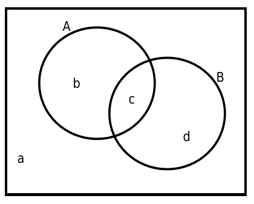

# 《随机过程理论的课后习题（第一章）》`2024-10-03`

-  还没做完，在这里列举一些比较有趣的题目。

## 1.1 (3)

- 求证 $|P(AB)-P(A)P(B)|\leq\frac{1}{4}$

- 观察上图 $a+b+c+d=1, a\geq 0, b\geq 0, c\geq 0, d\geq 0$
- 在此条件下，我们需要计算 $c-(b+c)(c+d)$ 的最小值和最大值
  - 我们需要证明最大值 $\leq \frac 1 4$，最小值 $\geq -\frac 1 4$
- 为了让结构更加清晰我们可以做一些必要的等价变换

$$
\begin{aligned}
c-(b+c)(c+d)&=c-(bc+bd+c^2+cd)\\
&=-c^2+(1-b-d)c-bd\\
&=-c^2+(a+c)c-bd\\
&=ac-bd
\end{aligned}
$$

- 因此我们只需要计算 $ac-bd$ 的最小值和最大值
  - $ac-bd\leq ac\leq \frac{1}{4}(a+c)^2\leq \frac{1}{4}$
  - $ac-bd\geq -bd\geq -\frac{1}{4}(b+d)^2\geq -\frac{1}{4}$

## 1.3

- 在 $t$ 时间内向电话总机呼叫的概率为

$$
P_t(k)=\frac{\lambda ^k}{k!}e^{-\lambda}
$$

- 其中，$\lambda>0$ 为常数。如果任意两相邻时间间隔内的呼叫次数是相互独立的，求时间 $2t$ 内呼叫 $n$ 次的概率 $P_{2t}(n)$。
- 虽然说我知道这个题中给出的概率质量函数其实就是泊松分布，但是我想自己写一下这个证明。
  - 写得时候突然发现了一些蛮有趣的事情，这是我之前完全没有想到的。
- 首先，我们可以将长度为 $2t$ 的时间划分为两个长度为 $t$ 的时间，这样我们就有：

$$
\begin{aligned}
P_{2t}(n)&=\sum_{k=0}^n\left(P_t(k)\cdot P_t(n-k)\right)\\
&=\sum_{k=0}^n\frac{\lambda^{n}}{k!(n-k)!}\cdot e^{-2\lambda}\\
&=\lambda ^n\cdot e^{-2\lambda}\cdot \sum_{k=0}^n \frac{1}{k!(n-k)!}
\end{aligned}
$$

- 如果你注意力惊人，你就会发现其实：

$$
\sum_{k=0}^n \frac{1}{k!(n-k)!}=\frac{2^n}{n!}
$$

- 上面这个东西我想了一小会才想明白为什么，所以感觉还是挺神奇的，所以打算写一下。
  - 要证明 $\sum_{k=0}^n \frac{1}{k!(n-k)!}=\frac{2^n}{n!}$
  - 只需证明 $\sum_{k=0}^n \frac{n!}{k!(n-k)!}=2^n$ 看到被求和的东西实际上就是二项式系数
  - 因此就是证明 $\sum_{k=0}^n \binom{n}{k}=2^n$
  - 根据牛顿二项式定理得证：

$$
2^n=(1+1)^n=\sum_{k=0}^n\left(1^k\cdot1^{n-k}\cdot\binom{n}{k}\right)=\sum_{k=0}^n \binom{n}{k}
$$

- 因此：

$$
P_{2t}(n)=\lambda ^n\cdot e^{-2\lambda}\cdot \frac{2^n}{n!}=\frac{(2\lambda)^n}{n!}\cdot e^{-2\lambda}
$$

- 不难发现本质上就是倍增了 $\lambda$ 的泊松分布。

## 1.4

- 做一系列独立重复实验，每次实验成功的概率为 $p$。求在成功 $n$ 次之前，至少失败了 $m$ 次的概率。
  - 也就是求
  - 进行了若干次实验，成功次数小于等于 $n-1$，失败次数等于 $m$，且最后一次实验为失败的概率。
  - 枚举成功次数求和即可

$$
\begin{aligned}
P&=(1-p)\cdot\sum_{k=0}^{n-1}\left(p^k(1-p)^{m-1}\cdot\binom{m-1+k}{k}\right)\\
&=(1-p)^m\cdot\sum_{k=0}^{n-1}\left(p^k\cdot \binom{m-1+k}{m-1}\right)
\end{aligned}
$$

- 答案给的是

$$
\sum_{k=m}^{\infty}\binom{k+n-1}{k}p^n(1-p)^k
$$

- 有道理啊
  - 所以我比较好奇上面的两个数是不是一样的？哎，感觉这个不是我能证明得了的问题。
- 唯一真神 cppascalinux 大佬用生成函数的方法证明了，当 $m>0$ 时我给出的答案与教材给出的答案相同。
  - 有时间要整理一下这个过程，我先把 cppascalinux 大佬的证明过程放到私有日志了。
  - `2024-10-05` cppascalinux 大佬使用非生产函数的方法再次证明了上述两个东西是相等的。
  - 详见：[2024-10-05_cpp-prof.md](../../data/2024a-rand/2024-10-05_cpp-prof.md)

