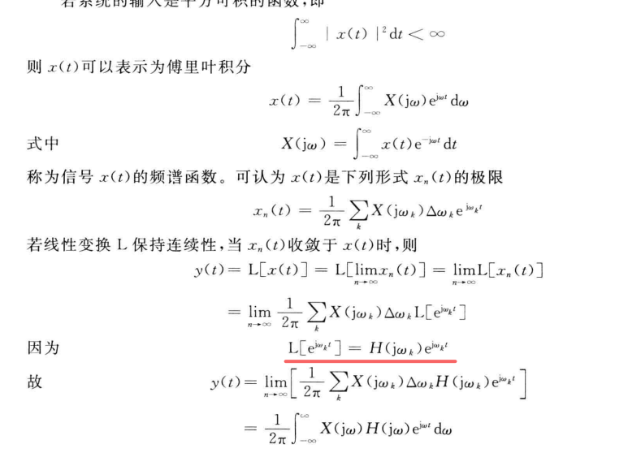

# 《随机过程理论》课程笔记 

## 置顶

- 作业整理：https://github.com/GGN-2015/stochastic-process-homework
- 课件整理：https://github.com/GGN-2015/stochastic-process
- 笔记整理：https://github.com/GGN-2015/stochastic-process-note

## 课程笔记

1. [2024-09-09_2024a-rand.md](../../data/2024a-rand/2024-09-09_2024a-rand.md)
2. [2024-09-23_2024a-rand.md](../../data/2024a-rand/2024-09-23_2024a-rand.md)
3. [2024-09-30_2024a-rand.md](../../data/2024a-rand/2024-09-30_2024a-rand.md)
4. [2024-10-14_2024a-rand.md](../../data/2024a-rand/2024-10-14_2024a-rand.md) (还没写完)
5. 发现了一个很悲观的事情，这个课的笔记我已经完全跟不下来了。
   1. 笔记里有很多我无法短时间内彻底想清楚的东西。

## 习题整理

1. [2024-10-03_rand-ex.md](../../data/2024a-rand/2024-10-03_rand-ex.md)
2. 第一章作业：[ch-01-rand-ex.md](../../data/2024a-rand/ch-01-rand-ex.md)
3. `2024-10-28` 完成了第二章作业的前五题。
4. `2024-12-03` QBH 大佬问：这个推倒怎么来的，我看不懂啊。

## 关于作业

- `2024-12-15` 完成了第一章作业：`neko launch neko://Archive/2024-12-15_随机过程作业`

## 课程信息

1. 课程微信群：暂无、等待助教建立。
2. 打算看看能不能找点课后习题做一做，感觉这个课程好难。
3. 【【北航2系随机过程】EP03 窄带过程】 https://www.bilibili.com/video/BV1LK411t7eq
4. `2025-01-07` 关于作业提交：

> 这个作业 电子版的 大家打印一下，作业交在新主楼F601 门口，这个窗台上。本周四晚之前交完@所有人 

## 课件列表

- 第一章.pdf
- 第二章.pdf
- 第三章.pdf

