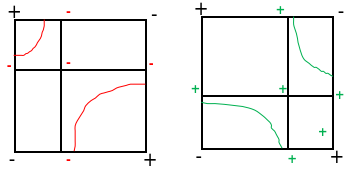

# 《科学计算可视化》`2024-09-30` `B106`

## P1 

- 回顾
  - 三位标量的规则数据场
    - 体元：体积微圆
    - 体素：存储数据值的单位
  - 等值线、等值面
    - 线性插值假设
    - 数据场中使用线性插值求得任意一点的坐标值
- 二维平面上计算线性插值的方法
  - 方法 1：辅助点法，即，计算两次线性插值
  - 方法 2：解线性方程组：$F=a_0+a_1x+a_2y+a_3xy$ 带入四个角点做法
  - 老师说上述两种做法得到的结果一定是一样的，我算一下。
    - 详见：[2024-09-30_bilinear.md](../../data/2024a-visc/2024-09-30_bilinear.md)
  - 实践中使用方法 2 的地方更多
    - 用时间换空间，对于每个体元可以先预处理出 $a_0, a_1, a_2, a_3$ 的结果
    - 这个方程可以证明一定有唯一解
  - 三维空间中可以使用三线性插值，这时线性方程组将有八个系数
    - $F=a_0+a_1x+a_2y+a_4z+a_3xy+a_5xz+a_6yz+a_7xyz$
- 线性插值常常用于图形学中的纹理映射工作
  - 在科学计算可视化中也被用于计算任意点处的场值
- 线性插值 Matching Cubes 的一些问题
  - 问题 1：等值面的近似性问题
    - 线性插值假设有时候不能很好得表征稀疏数据
    - 例：
      - 以气象模拟为例，NS 方程的微元法求解
      - 由于体元很大 （10km ～ 2500 km），因此线性插值处理往往不合适
  - 问题 2：
    - 双线性插值下的等势面实际上是一个双曲面，但是 MC 算法将他近似为若干平面
    - 据说在实践上使用双曲面再进行三角剖分对精度影响不大
      - 我觉得其实也有道理，毕竟体元本身就是一个精度限制
- 单元剖分法与 Matching Cubes 二义性问题
  - MC 算法带来的等值面二义性问题，观察一个正方形表面

- 上图中展示了红色与绿色的两种连接方式，都有道理。
  - 一般来说，具体采用哪种连法，我们需要观察双曲线两条渐进线的交点处的函数值是正还是负。
  - **这个地方其实我还是希望老师能具体阐述一下细节，不过我已经理解了问题不大，下面的内容是我补充的**。

- 首先我们知道 $F=a_0+a_1x+a_2y+a_3xy$ 是我们得到的插值方程
  - 那么其中一个等势面必然形式为 $a_0+a_1x+a_2y+a_3xy=k$，化简得到

$$
y=-\frac{a_1}{a_3}+\frac{\frac{a_1a_2}{a_3}+k-a_0}{a_2+a_3x}
$$

- 上面的表达式本质上就是一个以 $a_2+a_3x$ 为自变量的反比例函数
  - 不过就是对 $y=x^{-1}$ 进行了一些横纵坐标上的缩放
  - 现在我们知道一个事情，就是双曲线的两条渐近线，实际上就是当 $k$ 趋向于极端时双曲线的极限位置
  - 因此实际上这两条渐进线（的并集）本身也是 $F$ 的一条等值线，我们可以证明这一点
    - 先找到渐进线：
      - $x\to \infty$ 时，$y\to -\frac{a_1}{a_3}$
      - $y\to\infty$ 时，$x\to -\frac{a_2}{a_3}$
    - 验证
      - $F(-\frac{a_2}{a_3}, y)=a_0+a_1(-\frac{a_2}{a_3})+a_2y+a_3(-\frac{a_2}{a_3})y=a_0-\frac{a_1a_2}{a_3}$ 与 $y$ 无关
      - $F(x, -\frac{a_1}{a_3})=a_0+a_1x+a_2(-\frac{a_1}{a_3})+a_3x(-\frac{a_1}{a_3})=a_0-\frac{a_1a_2}{a_3}$ 与 $x$ 无关
  - 那么现在我们发现，上面的这个十字形等值线，实际上将正方形进一步划分为了四个小矩形
    - 而四个小矩形内部该如何画线，是清晰的
    - 完全取决于 $a_0-\frac{a_1a_2}{a_3}$ 的正负性
      - 我们无须考虑 $a_3=0$ 的情况，因为 $a_3=0$ 时我们能够证明正方形的四条边上不可能都有交点
  - 因此其实我们只需要观察 $a_0-\frac{a_1a_2}{a_3}$ 的正负性即可。
    - 等这个值大于零，绘制结果参考上述绿色曲线。当绘制结果小于零，绘制结果参考上述红色曲线。
    - 或许加个图更清晰。

## P2

- MC 算法的其他二义性问题，相邻重合面上的划分一致性问题
  - 参考 Nielson 2003 的做法
  - 列出了很多的情况，编程实现比较复杂
  - 提出了 asymptotic decider，但由于自然状态下比较少见，因此一般 MC 实现并不实现这一步。
- 使用三角形或四面体实现等值面剖分以解决二义性：
  - 六面体体元 => 【剖分】=> 四面体体元 => 【MT】 => 三角形等值面集合
  - 常见划分思路：5 划分、12 划分、24 划分
- 5 划分可能存在的问题
  - 等值面的划分结果依赖于划分方式
  - 相邻正方体中的划分应当满足邻边一致性
  - 四面体划分仍然有二义性的根本原因
    - 平行于边的线性插值下，对角线并不是线性函数，而是二次函数
    - 二次函数可能有两个零点，不能简单地用两端的正负性衡量零点个数，还要看判别式
- MT 算法
  - 考虑一个三角形的所有常见零点个数情况
  - 类似于 MC 算法中对双曲线渐近线交点正负性的考虑
  - MT 算法中在可能存在二义性的情况下也需要引入辅助点或者辅助线，根据辅助点正负判断连接方式
    - 或者在辅助线上找零点
- 优化思路
  - 对于某个等值面而言，其实有大量体元并没有被等值面穿过
  - 因此可以用树形结构优化等值面计算

## P3

- 在三维空间中具体可以采用 k-d 树或者空间八分树
  - 记录每个节点子树中所有所有体素函数值的 min 以及 max
  - 递归计算等势面，在必要时进行剪枝（如果 $k\notin [min, max]$ 就不用递归这棵子树了）
  - 是一种用时间换空间的方法
- 按需八叉树（branch-on-need）
  - 对子节点的编号顺序有明确规定，以便于编程实现
  - 不使用均匀二分，而是使用不均匀的二分以保证未来的划分尽可能的均匀
  - 在数据库领域也被使用
- 问题 4：细节保留问题
  - SDF 采样会导致几何体失去一些细节
  - 什么是细节
    - 细节就是指模型中尖锐的部分
    - 各种转换往往会导致细节损失
    - 距离场中、即使采样率比较高的前提下，图像的棱角还是会被削去
- 距离场
  - 一种几何表面的隐式表示方式
  - 距离的定义要满足三个基本性质
  - 距离场一定是 $C^0$ 连续的，欧式距离距离场一定是 $C^1$ 连续的
  - 距离场的优点：
    - 容易处理几何的布尔运算
    - 易于处理断裂等拓扑结构改变
    - 梯度可以得到面法向量
- ADFs：自适应采样数据场（SIGGRAPH 2000）
  - 使用八叉树、三角剖分、小波变换都可以实现 ADFs

## 课后互动

- 问：双线性差值下先横后纵和先纵后横得到的表达式结果一致吗？
  - 答：是一致的，而且都和方程法得到的结果一致。
  - 我算了一下确实是，详见：[2024-09-30_bilinear.md](../../data/2024a-visc/2024-09-30_bilinear.md)

