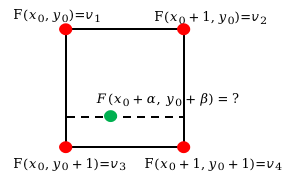

# 《关于双线性插值的证明》`2024-09-30`

 

## 双线性插值的做法

- 我们不妨先纵后横

$$
\frac{F(x_0, y_0+\beta)-F(x_0, y_0)}{\beta}=\frac{F(x_0, y_0+1)-F(x_0, y_0)}{1}
$$

- 于是得到

$$
\frac{v_L-v_1}{v_3-v_1}=\beta
$$

- 解得

$$
v_L=v_1+\beta\cdot (v_3-v_1)
$$

- 同理可知

$$
v_R=v_2+\beta\cdot (v_4-v_2)
$$

- 再次计算线性插值得到

$$
\frac{v_M-v_L}{\alpha}=\frac{v_R-v_L}{1}
$$

- 因此

$$
v_M=v_L+\alpha\cdot(v_R-v_L)
$$

- 带入 $v_L$ 和 $v_R$ 得到

$$
\begin{aligned}
v_M&=(1-\alpha)v_L+\alpha v_R\\
&=(1-\alpha)\cdot(v_1+\beta\cdot (v_3-v_1))+\alpha\cdot (v_2+\beta\cdot (v_4-v_2))\\
&=(1-\alpha)(1-\beta)v_1+(1-\alpha)\beta v_3+\alpha (1-\beta) v_2+\alpha\beta v_4
\end{aligned}
$$

- 由于 $v_1, v_2, v_3, v_4$ 已知，所以我们可以整理成关于 $\alpha, \beta$ 的形式

$$
v_M=v_1+(-v_1+v_2)\alpha+(-v_1+v_3)\beta+(v_1-v_2-v_3+v_4)\alpha\beta
$$

## 解方程的做法

- 设 $G(\alpha, \beta)=F(x_0+\alpha, y_0+\beta)$，于是只需要计算 $G(\alpha, \beta)$ 的解析形式。

$$
G(\alpha, \beta)=a_0+a_1\alpha+a_2\beta+a_3\alpha\beta
$$

- 已知过四个点

$$
G(0, 0)=v_1\\
G(1, 0)=v_2\\
G(0, 1)=v_3\\
G(1, 1)=v_4
$$

- 挨个带入

$$
\begin{aligned}
G(0, 0)=v_1&=a_0\\
G(1, 0)=v_2&=a_0+a_1\\
G(0, 1)=v_3&=a_0+a_2\\
G(1, 1)=v_4&=a_0+a_1+a_2+a_3
\end{aligned}
$$

- 解得

$$
\begin{aligned}
a_0&=v_1\\
a_1&=v_2-v_1\\
a_2&=v_3-v_1\\
a_3&=v_4-v_3-v_2+v_1
\end{aligned}
$$

- 发现两种做法的计算结果确实是一样的。
- 从而可以间接说明双线性插值在横纵两个方向上先横后纵还是先纵后横计算的结果应当是一致的。

