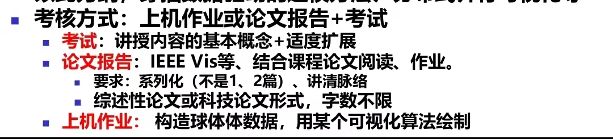

# 《科学计算可视化》课程笔记

## 课程笔记

1. [2024-09-09_2024a-visc.md](../../data/2024a-visc/2024-09-09_2024a-visc.md)
2. [2024-09-23_2024a-visc.md](../../data/2024a-visc/2024-09-23_2024a-visc.md)
3. [2024-09-30_2024a-visc.md](../../data/2024a-visc/2024-09-30_2024a-visc.md)
4. [2024-10-14_2024a-visc.md](../../data/2024a-visc/2024-10-14_2024a-visc.md) (有大量需要结合 PPT 思考的东西)

## 课程信息

1. 课程微信群名称：【科学计算可视化2024】

2. `2024-09-10` 助教在微信群发言

> @所有人 
> 本课程由于中秋、国庆放假，课程少上两次课，暂定在放假后安排一次补课，时间待定

3. `2024-10-27` 关于期末大作业：

> 大作业直接提交至梁老师邮箱 Liang_xiaohui@buaa.edu.cn
>
> 截止时间是在考试结束后两周，这之前任意时间提交，大家尽量不要太晚提交哈
>
> 

## 课件列表

- 01-科学计算可视化-第01讲第01次-绪论.pdf
- 02-科学计算可视化-第02讲第01次-规则数据场及MC.pdf
- 03-科学计算可视化-第02讲第02次-规则数据场及MC.pdf
- 03-科学计算可视化-第02讲第03次-距离场插讲.pdf
- 04-科学计算可视化-第03讲第01次-规则数据场的体绘制.pdf
- 05 -科学计算可视化-第03讲第00次-科学计算可视化中的问题.pdf
- 05-科学计算可视化-第03讲第02次-规则数据场的体绘制.pdf
- 06-!State of the Art inTransferFunctions forDirectVolumeRendering.pdf
- 06-!TVCGMultidimensional Transfer Functions for Interactive Volume Rendering-TVCG.pdf
- 06-科学计算可视化-第03讲第03次-规则数据场的体绘制.pdf
- 07 01-科学计算可视化-第03讲第04次-规则数据场的体绘制.pdf
- 07 02-科学计算可视化-第03讲第05次-规则数据场的体绘制.pdf
- 07-科学计算可视化-第03讲第05次-vtk经验.pdf

