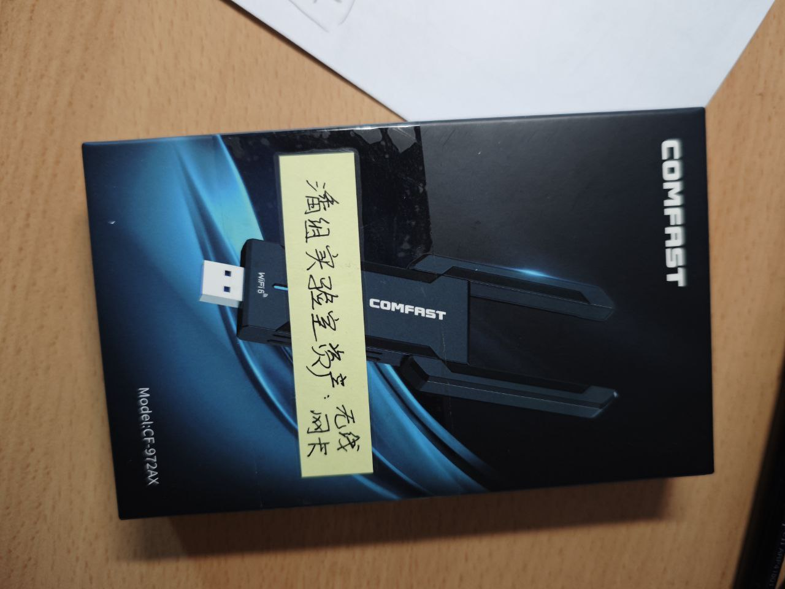

# 《`GGN_2015` 在硕士生期间的工作日志》

## 子项目

- 关于实验室官网：[webpage-buaa-vr.md](../../data/buaa-vr/webpage-buaa-vr.md)
- 看到了一个去年的讲图形学相关期刊会议的博客，感觉可以看看：https://blog.csdn.net/tiao_god/article/details/131515496
- 关于骨肿瘤手术规划项目 [bone-tumor-buaa-vr.md](../../data/buaa-vr/bone-tumor-buaa-vr.md)

## 杂项

- `2024-12-13` IEEE VR 的完整论文集，不一定能下载：https://ieeexplore.ieee.org/xpl/conhome/10536145/proceeding

## 无线网卡

- `2024-12-14` 测试网卡是否可用。可用，目前这个无限网卡保管在 “电子产品” 分区。今天由于 hololens 被借走了，所以没有办法联机测试。

