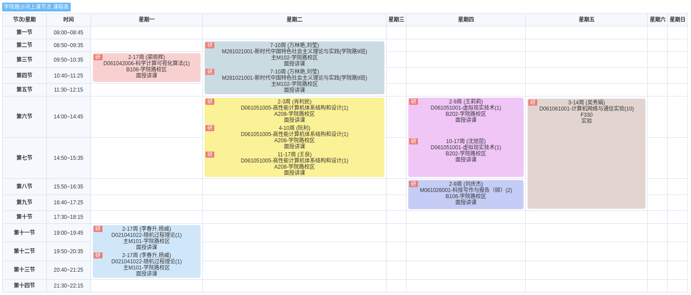

# 1.2.2 课程列表

## 0. 规则

1. 填写顺序：
   1. 此文档应当按照时间顺序，从后向前编排。

## 1. 2024 年秋季课程

| 课程名称                   | 存档链接                                                     | 备注                     |
| -------------------------- | ------------------------------------------------------------ | ------------------------ |
| 科学计算可视化             | [2024a-visc-index.md](../../data/2024a-visc/2024a-visc-index.md) |                          |
| ~~网络与信息安全~~         | ~~[2024a-netsec-index.md](../../data/2024a-netsec/2024a-netsec-index.md)~~ | **已退课**               |
| 随机过程理论               | [2024a-rand-index.md](../../data/2024a-rand/2024a-rand-index.md) | 听说比较难               |
| 高性能计算机体系结构和设计 | [2024a-hpcs-index.md](../../data/2024a-hpcs/2024a-hpcs-index.md) |                          |
| 计算机网络与通信实验       | [2024a-netexp-index.md](../../data/2024a-netexp/2024a-netexp-index.md) |                          |
| 虚拟现实技术               | [2024a-vr/2024a-vr-index.md](../../data/2024a-vr/2024a-vr-index.md) |                          |
| 科技写作与报告             | [2024a-engwri-index.md](../../data/2024a-engwri/2024a-engwri-index.md) |                          |
| 机器学习                   | [2024a-ml-index.md](../../data/2024a-ml/2024a-ml-index.md)   | 软件学院开设，**已退课** |
| games101                   | [2024a-games101-index.md](../../data/2024a-games101/2024a-games101-index.md) | 线上课程                 |

