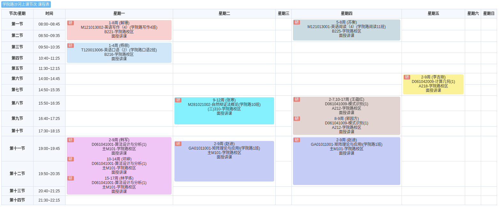

# 《课程笔记》

## 课程列表规则

1. 填写顺序：
   1. 此文档应当按照时间顺序，从后向前编排。
2. `2024-11-21` 经过一些思想斗争以及事实上的困难，`GGN_2015` 决定恢复原先只作纸质笔记不作电子笔记的习惯。
   1. 由于电子笔记的记录实在是太耗时了。
   2. `2025-01-07` `GGN_2015` 觉得以后可以把自己的课程笔记扫描成 PDF 然后在 github 上公开出来。

## 2025 年春季课程

| 课程名称       | 存档链接                                                | 备注 |
| -------------- | ------------------------------------------------------- | ---- |
| 英语写作       | https://github.com/GGN-2015/2025-spring-english-writing |      |
| 英语口语       | https://github.com/GGN-2015/2025-spring-english-oral    |      |
| 算法设计与分析 |                                                         |      |
| 矩阵理论与应用 |                                                         |      |
| 模式识别       |                                                         |      |
| 计算几何       |                                                         |      |
| 英语阅读       |                                                         |      |
| 自然辩证法     |                                                         |      |

## 2024 年秋季课程

| 课程名称                   | 存档链接                                                     | 备注                     | `GGN_2015` 评价                                            |
| -------------------------- | ------------------------------------------------------------ | ------------------------ | ---------------------------------------------------------- |
| 科学计算可视化             | [2024a-visc-index.md](../../data/2024a-visc/2024a-visc-index.md) |                          | 比较好的课程（**完结撒花，及格就行**）                     |
| ~~网络与信息安全~~         | ~~[2024a-netsec-index.md](../../data/2024a-netsec/2024a-netsec-index.md)~~ | **已退课**               |                                                            |
| **随机过程理论**           | [2024a-rand-index.md](../../data/2024a-rand/2024a-rand-index.md) | 听说比较难               | 经典硬核好课（**完结撒花，及格就行**）                     |
| 高性能计算机体系结构和设计 | [2024a-hpcs-index.md](../../data/2024a-hpcs/2024a-hpcs-index.md) |                          | 水课（**完结撒花，及格就行**）                             |
| **计算机网络与通信实验**   | [2024a-netexp-index.md](../../data/2024a-netexp/2024a-netexp-index.md) | 听说比较难               | 经典硬核好课（**完结撒花，及格就行**）                     |
| 虚拟现实技术               | [2024a-vr-index.md](../../data/2024a-vr/2024a-vr-index.md)   |                          | 内容不难，汇报要求高得一批（**完结撒花，及格就行**）       |
| 科技写作与报告             | [2024a-engwri-index.md](../../data/2024a-engwri/2024a-engwri-index.md) |                          | 水课（**完结撒花，及格就行**）                             |
| ~~机器学习~~               | ~~[2024a-ml-index.md](../../data/2024a-ml/2024a-ml-index.md)~~ | 软件学院开设，**已退课** |                                                            |
| games101                   | [2024a-games101-index.md](../../data/2024a-games101/2024a-games101-index.md) | 线上课程                 | 经典好课                                                   |
| 新时代中国特色社会主义     | [2024a-chi-cha-soc-index.md](../../data/2024a-chi-cha-soc/2024a-chi-cha-soc-index.md) | 总共四节课               | 值得认真思考（**做线上作业！**）（**完结撒花，及格就行**） |

