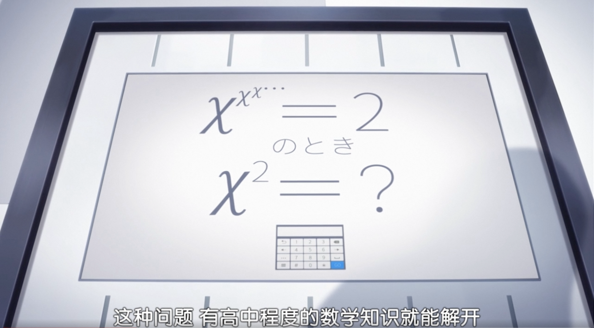
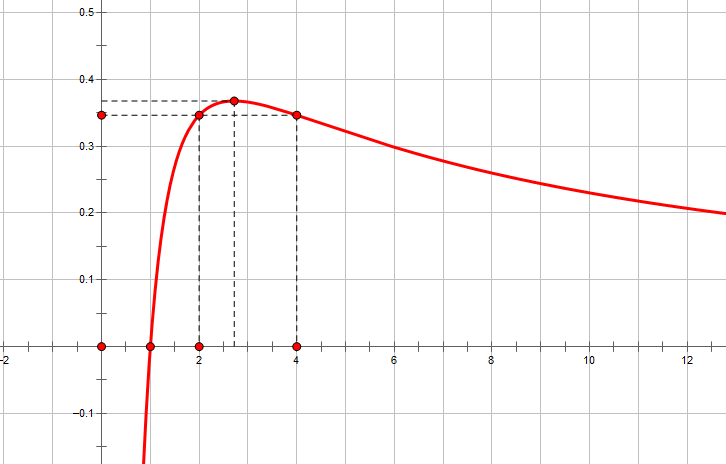
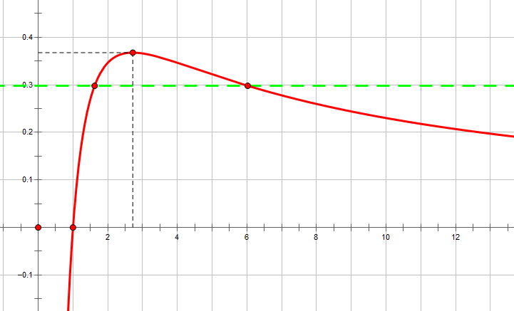
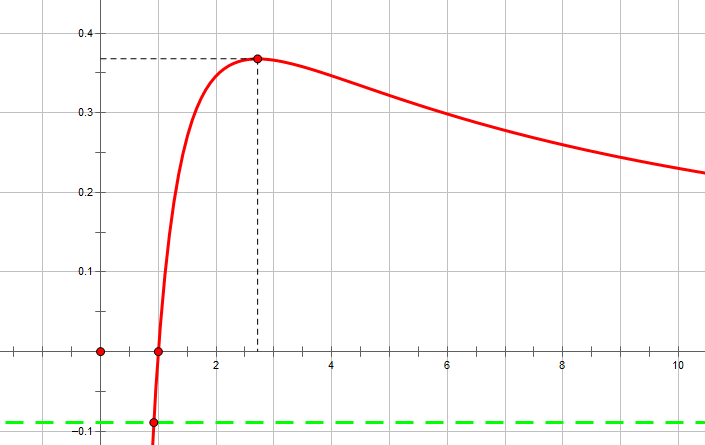
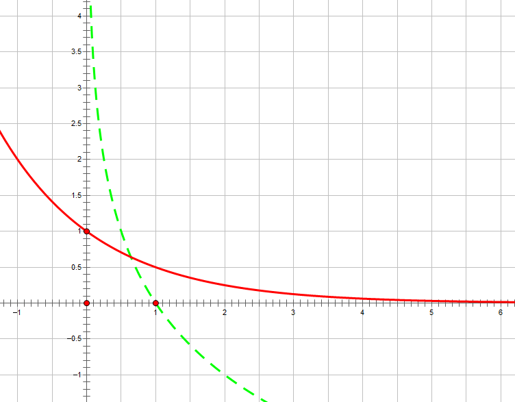

# 《一道有趣的极限问题及其拓展》`2023-09-08`

```json
{
    "tags":["math"]
}
```

- `2023-09-08` 于长春到北京的 G916 高铁上编写《一道有趣的极限问题及其拓展》

## 特别鸣谢

- `adipy` 大佬：`2023-09-08` 和我从 0 点讨论到 3 点多

- `HocRiser` 大佬：帮我找到了狂赌之渊里的那张图并且愿意帮我审稿

- `Zouki Li` 大佬：提供了一种针对  $0<a<1$ 情况收敛性更简单的归纳证明方式（即本文中使用的方法）

## 0.前言

我第一次见到这个问题，大概已经说不清是多久以前的事了。上一次认真思考这个问题大概是在大二，那个时候胡老（`HocRiser`）在看狂赌之渊的第二季，其中第十集上半段有一幕就出现了这个问题：



 （我想知道日本的高中生真的会证明这种东西吗？我觉得高中知识或许能解出来上面这个题，但是您如何证明上述表达式的 $x$ 有解？）

不过相比之下我更关注这个事：
$$
\sqrt2 ^{\sqrt2 ^{\sqrt2^{\sqrt 2^\cdots}}}=?
$$


这个东西感觉放到我小学的时候，我可能会不假思索地设答案为 $t$，然后去解 $\sqrt2^t=t$ 这个方程，然后得到 $t=2$。但是对于勉强上了大学的我而言，$t=2$ 这个答案似乎并不重要，而真正重要的事情却是——如何证明这个表达式确实是“收敛的”。因为当我们试图通过上面的设 $t$ 的方法解决这个问题时，我们实际上已经私自假定了这样一个事实：

- $\sqrt2 ^{\sqrt2 ^{\sqrt2^{\sqrt 2^\cdots}}}$ 确实能收敛到一个有限的值，不会在计算的过程中趋于无穷。

但这个事实实际上并不显然。

## 1. 原始问题的收敛性证明

如题，即：
$$
\begin{aligned}
&\text{let}\;A_1=\sqrt2, A_n=\sqrt2^{A_{n-1}}(n\geq 2)\\
&\text{proof}\;\lim_{n\to\infty}A_n\;\text{exists.}
\end{aligned}
$$
这个东西我感觉应该还是挺好证明的：单调有界必收敛。

### 1.1 证明数列的有界性

出于一些神奇的魔法，其实我们已经分析出原序列的一个界是 $(1, 2)$，把这个东西形式化地证明出来就行。
$$
\begin{aligned}
&\text{let} \; f(x)=\sqrt2^{x}\\
&\text{proof} \; \text{when} \; x\in(1, 2), f(x)\in(1, 2)
\end{aligned}
$$
首先 $f(x)$ 在 $x\in(1, 2)$ 时单调递增（指数函数的性质），因此上一定有：
$$
\text{when} \; x\in(1, 2), \sqrt{2}=f(1)<f(x)<f(2)=2
$$
由于 $A_n=f(A_{n-1})$，只要我们有 $A_1\in(1, 2)$，我们就能数学归纳地证明出 $\forall\;n\in \mathbb{Z}_+, A_n\in(1, 2)$.

综上，有界性得证。

### 1.2 证明数列的单调性

只需要证明：
$$
\forall n \in \mathbb{Z}_+, A_{n}<A_{n+1}
$$
只需证明：
$$
\forall n\in \mathbb{Z}+,A_n<\sqrt2^{A_n}
$$
这个地方我们最好先用分析法，来比较清楚地展示出我们的思维过程：

我们想要探究的是：$t<\sqrt2 ^ t$ 在 $t$ 处于**什么范围内**是成立的，然后再说明 $A_n$ 一定**恰好在这个范围里**，从而证明数列 $\{A_n\}$ 单调。

换一种说法说，前文中我们定义了一个函数 $f$，而数列 $A_n$ 可以视为是由函数 $f$ 迭代生成出来的（即 $A_n=f(f(f(\cdots f(A_1))))=f^{(n-1)}(A_1)$）。 如果，单次迭代会使原数变大，那么就能说明，原序列是单调递增的。
$$
\begin{aligned}
&\text{when}\;t>1\\
&t<\sqrt2^t\\
&\Leftrightarrow t^2<2^t\\
&\Leftrightarrow 2\ln t< t\ln 2\\
&\Leftrightarrow \frac{\ln t}{t}<\frac{\ln 2}{2}
\end{aligned}
$$
对于熟悉高中导数的同学们来说，函数 $h(x)=\frac{\ln x}{x}$ 或许并不陌生，他的图像大概长成这个样：



我们可以用求导的方式，证明曲线 $y=h(x)$ 在 $x<e$ 时单调递增，$x>e$ 时单调递减。

因此，如果想要使得 $h(t)<h(2)$，只需要保证 $t<2$ 或者 $t>4$ 即可。

因此：
$$
\begin{aligned}
&\text{when}\;t>1\\
&t<\sqrt2^t\\
\Leftrightarrow \;&t^2<2^t\\
\Leftrightarrow \;&2\ln t< t\ln 2\\
\Leftrightarrow \;&\frac{\ln t}{t}<\frac{\ln 2}{2}\\
\Leftrightarrow \;&h(t) < h(2)\\
\Leftrightarrow \;&t < 2\; \text{or} \; t>4\;\;(*)
\end{aligned}
$$
而我们在 $1.1$ 节已经证明了 $\forall n \in \mathbb{Z}_+, A_n<2$，
$$
\begin{aligned}
&\text{when} \; n \in \mathbb{Z}_+\\
&h(A_n)<h(2)\\
\Leftrightarrow\; &A_n<\sqrt2^{A_n}\;\;(借助上述\;(*)\;式)\\
\Leftrightarrow\; &A_n<A_{n+1}
\end{aligned}
$$
综上所述，单调性得证。

### 1.3 求出原始问题答案

根据 $1.1$ 和 $1.2$，我们可以证明原序列收敛，因为单调有界必收敛，因为原序列收敛，我们不妨设原序列收敛于常数 $A$。

因为 $\forall n\in\mathbb{Z}_+, A_n<2$，因此 $A=\lim_{n\to\infty}A_n\leq 2$（序列的界亦是序列极限的界）。

然后解方程 $\sqrt2^A=A$，这个东西实际上有两个解，分别为 $A=2$ 和 $A=4$，但是由于 $A\leq 2$，所以 $A=4$ 是增根。

综上所述：
$$
\sqrt2^{\sqrt2^{\sqrt2^{\sqrt2 ^ {\cdots}}}}=2
$$

## 2. 第一个拓展方向：$\sqrt a$

根号下何必是 $2$，我觉得是几都行。
$$
\begin{aligned}
&\text{suppose}\;a>1\\
&\text{when} \; \text{does} \; \sqrt a^{\sqrt a^{\sqrt a^{\sqrt a^ {\cdots}}}} \; \text{converge}
\end{aligned}
$$
当 $a$ 属于什么范围内的时候，这个无穷指数表达式收敛，这是我们要探究的第二个问题。经过昨晚的研究，我们已经证明出 $1<a\leq e^{\frac{2}{e}}$ 时上述表达式收敛，接下来我们来证明这个结论。

请注意，我们接下来的所有讨论，都只关注 $a>1$ 的情况，对于 $a\leq 1$ 的情况我们并不研究。

### 2.1 探究收敛的必要条件

我们假设
$$
\sqrt a^{\sqrt a^{\sqrt a^{\sqrt a^{\cdots}}}} \; \text{converges} \; \text{to} \; A
$$
那么一定有这样的一个事实就是 $A$ 一定是迭代函数 $f(x)=\sqrt a^x$ 的不动点。

那么我们可以根据逆否定理得到：

倘若 $f(x)=\sqrt a^x$ 没有不动点，那么 $\sqrt a^{\sqrt a^{\sqrt a^{\sqrt a^{\cdots}}}}$ 一定不可能收敛。因此，$f(x)=\sqrt a ^ x$ 存在不动点是原序列收敛的一个必要条件（我们将来能够证明，实际上他也是充分条件）。

$f(x)$ 有不动点，那么以 $x$ 为未知数的方程 $\sqrt a^x=x$ 有解：
$$
\begin{aligned}
&(\text{we} \; \text{always} \; \text{suppose}\;a>1)\\
&\sqrt a^x=x\\
\Leftrightarrow\;&a^x=x^2\\
\Leftrightarrow\;&x\ln a=2\ln x\\
\Leftrightarrow\;&\frac{\ln a}{2}=\frac{\ln x}{x}
\end{aligned}
$$
那么我们考虑两条曲线：

- 第一条是 $y=\frac{\ln a}{2}$ 这是一条水平线
- 第二条是 $y=\frac{\ln x}{x}$ ，这是一条曲线，和 $1.2$ 中的插图是同一条曲线

如果这两条曲线，有交点，那么单次迭代函数存在不动点（交点横坐标即为不动点）。由于 $h(x)=\frac{\ln x}{x}$ 在 $x=e$ 处取得最大值 $h(e)=\frac{1}{e}$，因此 $\frac{\ln a}{2}\leq h(e)=\frac{1}{e}$ 时，不动点存在。

解得 $a\leq e^{\frac{2}{e}}$ 是不动点存在的条件，即 $a\leq e^{\frac{2}{e}}$ 是原无穷指数表达式收敛的一个必要条件。

### 2.2 证明上述必要条件的充分性

#### 2.2.1 证明有界性

与 $a=2$ 时，十分相似，我们仍然要通过单调有界的方式证明收敛。但是这次我们很难解出原表达式具体收敛到哪里，但是却能得到他是否收敛。



假设上图中的绿线是 $y=\frac{\ln a}{2}$，红色曲线是 $y=\frac{\ln x}{x}$，那么绿线与红线经常有两个交点。假设左侧的交点横坐标是 $x=a_1$ 右侧的交点横坐标是 $x=a_2$。（怕你忘了，顺便提一句，$a_1$ 和 $a_2$ 都是 $f(x)=\sqrt a^x$ 的不动点）
$$
\begin{aligned}
&\text{let}\; A_1=\sqrt a, A_n=\sqrt a^{A_{n-1}}(n \geq 2)\\
&\text{proof}\; \forall n\in \mathbb{Z}_+, 1<A_n<a_1
\end{aligned}
$$
由于我们只考虑 $a>1$ 的情况，所以一定有 $g(x)=\sqrt a^x$ 随 $x$ 增长单调递增，因此，我们有：
$$
\begin{aligned}
&\text{when}\; x\in(1, a_1)\\
&\sqrt a=g(1)<g(x)<g(a_1)=\sqrt a^{a_1}=a_1
\end{aligned}
$$
综上所述，我们可以证明原序列有界: $1<A_n<a_1$。

#### 2.2.2 证明单调性

只需证明 $A_n<A_{n+1}=\sqrt a^{A_n}$。只需证明单次迭代能使得原数值变大，方法与 $1.2$ 类似。

以 $t$ 为变量 $a$ 为常量，探究 $t<\sqrt a^t$ 的条件：
$$
\begin{aligned}
&(\text{we} \; \text{always} \; \text{suppose}\;a>1, t>0)\\
&t<\sqrt a^t\\
\Leftrightarrow\;& t^2<a^t\\
\Leftrightarrow\;& 2\ln t<t\ln a\\
\Leftrightarrow\;& \frac{\ln t}{t} < \frac{\ln a}{2}
\end{aligned}
$$
回去看上面那个带有绿色虚线的图，由于 $a_1<e$，所以 $x<a_1$ 时 $h(x)$ 单调递增，自然也就有：
$$
\begin{aligned}
&\text{when}\; x<a_1\\
&\frac{\ln x}{x}=h(x)<h(a_1)=\frac{\ln a}{2}
\end{aligned}
$$
因此单次迭代一定会使原数值变大，综上所述，单调性得证。

#### 2.2.3 求解收敛结果

使用与 $1.3$ 完全一样的方法，我们能够得到原无穷指数表达式收敛于 $a_1$ （即以 $x$ 为未知数，方程 $h(x)=\frac{\ln a}{2}$ 的小于等于 $e$ 的解）。

数列的界亦是极限的界，得到 $\lim_{n\to\infty}A_n\leq a_1$，不动点法解得极限  $A=a_1$ 或者 $A=a_2$，其中 $A=a_2$ 是增根。

综上所述：
$$
\begin{aligned}
&(\text{we} \; \text{always} \; \text{suppose}\;a>1)\\
&\text{when}\;a\leq e^{\frac{2}{e}},\sqrt a^{\sqrt a^{\sqrt a^{\sqrt a^{\cdots}}}}=a_1\\
&\text{where} \; x=a_1 \;\text{is\;the\;smaller\;solution\;for\;equation\;on\;} x: \frac{\ln x}{x}=\frac{\ln a}{2}
\end{aligned}
$$

### 2.3 第一个拓展方向的充要条件

综上所述，$a\leq e^{\frac{2}{e}}$ 是第一个拓展方向的充要条件，我们可以编写一个 `python` 脚本来大致验证一下这个事：

```python
from math import sqrt

def iter(A_1, f, n): # 在 A_1 基础上，使用迭代函数 f，迭代 n-1 次得到 A_n
    tmp = A_1
    for _ in range(n - 1):
        tmp = f(tmp)
    return tmp

def check_a(a, n): # 已知 a 的值，验证表达式是否收敛
    def f(x):
        return sqrt(a) ** x
    print("a = %f => A_%d = %40f" % (a, n, iter(sqrt(a), f, n)))

for i in range(-100, 150):
    a = 2 + i /1000
    check_a(a, 179) # 计算 A_179
```

这个程序的部分输出如下：

```
...
a = 2.069000 => A_179 =                                 2.348174
a = 2.070000 => A_179 =                                 2.357437
a = 2.071000 => A_179 =                                 2.367035
a = 2.072000 => A_179 =                                 2.377002
a = 2.073000 => A_179 =                                 2.387374
a = 2.074000 => A_179 =                                 2.398199
a = 2.075000 => A_179 =                                 2.409529
a = 2.076000 => A_179 =                                 2.421430
a = 2.077000 => A_179 =                                 2.433982
a = 2.078000 => A_179 =                                 2.447287
a = 2.079000 => A_179 =                                 2.461476
a = 2.080000 => A_179 =                                 2.476720
a = 2.081000 => A_179 =                                 2.493257
a = 2.082000 => A_179 =                                 2.511426
a = 2.083000 => A_179 =                                 2.531746
a = 2.084000 => A_179 =                                 2.555085
a = 2.085000 => A_179 =                                 2.583105
a = 2.086000 => A_179 =                                 2.619860
a = 2.087000 => A_179 =                                 2.682107
a = 2.088000 => A_179 =     23205781410878540417849098240.000000
```

不难发现 $a=2.088$ 的时候，迭代 $178$ 次后突然就变得非常大了，顺便说一句 $e^{\frac{2}{e}}\approx 2.087065228634533$。可以看到这和我们的理论是相符合的。

## 3. 第二个拓展方向：$\sqrt[\;^a] a$

$\sqrt[\;^a] a$ 表示 “$a$ 次根号下 $a$”，我们希望探究：
$$
\begin{aligned}
&(\text{we always suppose}\; a>1)\\
&\text{when does} {\sqrt[\;^a] a}^{{\sqrt[\;^a] a}^{{{\sqrt[\;^a] a}^{{\sqrt[\;^a] a}^{\cdots}}}}} \text{converge}?
\end{aligned}
$$
我们可以使用类似 $2.1$ 和 $2.2$ 的方法得到，无论 $a$ 取什么值，只要 $a>1$，原表达式 ${\sqrt[\;^a] a}^{{\sqrt[\;^a] a}^{{{\sqrt[\;^a] a}^{{\sqrt[\;^a] a}^{\cdots}}}}}$ 总是收敛的。

但是对于 $a\leq e$ 和 $a>e$ 两种情况，他们收敛到的最终答案却具有不同的形式：

- 当 $a\leq e$ 时 ${\sqrt[\;^a] a}^{{\sqrt[\;^a] a}^{{{\sqrt[\;^a] a}^{{\sqrt[\;^a] a}^{\cdots}}}}}=a$
- 当 $a>e$ 时 ${\sqrt[\;^a] a}^{{\sqrt[\;^a] a}^{{{\sqrt[\;^a] a}^{{\sqrt[\;^a] a}^{\cdots}}}}}=a', \text{where } x=a' \text{ is the smaller solution for equation on } x: \frac{\ln x}{x}=\frac{\ln a}{a}$

大致过程列举如下：

1. 首先，不动点存在时收敛的必要条件，然后惊奇地发现，不动点总是存在的
2. 然后，如果 $\frac{\ln a_1}{a_1}=\frac{\ln a_2}{a_2}$，那么 $\sqrt[\;^{a_1}] {a_1}=\sqrt[\;^{a_2}] {a_2}$
3. 最后，当 $a$ 取值使得 $f(x)=\left(\sqrt[\;^{a}] {a}\right)^{x}$ 有两个不动点时，数列会收敛于那个较小的不动点

## 4. 第三个拓展方向：$a$

### 4.1 探究收敛的必要条件

这个形式突然让我想起了我大概四五年前做过的一道 `OI` 题《上帝与集合的正确用法》，那道题目是一道使用欧拉定理解决的数论问题。

不过上帝与集合的正确用法那个题目和我们现在要讨论的问题没什么大关系，但是在形式上确实能够起到启发的作用。
$$
\begin{aligned}
&(\text{suppose a>0})\\
&\text{when does } a^{a^{a^{a^{\cdots}}}} \text{ converge}?
\end{aligned}
$$
首先 $a=1$ 时肯定收敛于 $1$，这要是都看不出来我这么多年数学算是白学了。

如果这个东西收敛，那么 $f(x)=a^x$ 肯定存在不动点（原理同 $2.1$），讨论 $a^x=x$ 何时有解。
$$
\begin{aligned}
&(\text{suppose a>0})\\
&a^x=x\\
\Leftrightarrow\;&x\ln a=\ln x\\
\Leftrightarrow\;&\frac{\ln x}{x} = \ln a
\end{aligned}
$$
 考虑水平线 $y=\ln a$ 与曲线 $y=\frac{\ln x}{x}$ 的相交情况，有交点说明 $f(x)$ 有不动点，没交点说明 $f(x)$ 没有不动点。由于 $\frac{\ln x}{x}$ 的最大值为 $\frac{1}{e}$，因此$\ln a\leq \frac{1}{e}$ 是不动点存在的充要条件，同时也是收敛的必要条件。

综上解得：$a<e^{\frac{1}{e}}$ 是收敛的一个必要条件（注：$e^{\frac{1}{e}}\approx1.444667861009766>1$）。

> 下面  $4.2$ 的论述毫无意义，因为在 $2.$ 节中，我们讨论了 $\sqrt a^{\sqrt a^{\sqrt a^{\sqrt a^{\cdots}}}}$ 在 $a>1$ 时的收敛情况，而 $a^{a^{a^{a^{\cdots}}}}$ 的收敛情况其实变量代换（令 $a=t^2$ 反解  $t$ 的取值范围）一下就求出来了，也用不着讨论。
>
> 那我为什么写了 $4.2$ 呢？高铁上脑抽了，写了一大堆，觉得删了有点可惜，但是 $4.3$ 的讨论还是有必要的。

### 4.2 对 $a>1$ 探究充分性

我们先仅考虑 $a>1$ 的情况：

还是老方法，设 $x=a_1$ 和 $x=a_2$ 是以 $x$ 为自变量的方程 $\frac{\ln x }{x}=\ln a$ 的两个解，其中 $a_1\leq a_2$。

#### 4.2.1 证明有界性

$$
\begin{aligned}
&\text{let}\; A_1=a, A_n={a^{A_{n-1}}}(n\geq 2)\\
&\text{proof}\; A_n\in(1, a_1)
\end{aligned}
$$

由于 $a>1$，因此 $f(x)=a^x$ 单调递增，因此有：
$$
\begin{aligned}
&\text{when}\;x\in(1, a_1)\\
&a=f(1)<f(x)<f(a_1)=a^{a_1}=a_1
\end{aligned}
$$
这说明，如果 $A_n\in(1, a_1)$，那么 $A_{n+1}=f(A_n)\in(1, a_1)$（注：$a>1$），又因为 $A_1=a\in(1,a_1)$，所以可以数学归纳法得到：
$$
\forall n\in\mathbb{Z}_+, A_n\in(1, a_1)
$$
有界性得证。

#### 4.2.2 证明单调性

只需要证明，当 $x\in(1, a_1)$ 时，$f(x)>x$。
$$
\begin{aligned}
&\text{suppose}\; a>1\\
&x<a^x\\
\Leftrightarrow\;& \ln x < x\ln a\\
\Leftrightarrow\;& \frac{\ln x}{x} < \ln a
\end{aligned}
$$
这个事显然成立：因为 $x<a_1\leq e$ 所以，$h(x)<h(a_1)<h(e)$ （位于 $y=h(x)$ 的单调递增区间）

而 $h(x)=\frac{\ln x}{x}$，$h(a_1)=\ln a$，因此得证。其后可以用数学归纳法证明数列 $A$ 单调递增。  

#### 4.2.3 收敛

根据 $4.2.1$ 以及 $4.2.2$ 可以得到：
$$
\begin{aligned}
&\text{when } 1<a<e^{\frac{1}{e}}\\
&a^{a^{a^{a^{\cdots}}}} = a_1\\
&\text{where } x=a_1\; \text{is the smaller solution for equation on } x:\; \frac{\ln x}{x}=\ln a
\end{aligned}
$$

### 4.3 考虑 $0<a<1$ 的情况

 对于 $0<a<1$ 的情况，$a^x=x$ 的不动点只有一个，而且这个不动点介于 $(0, 1)$ 之间。但是很不幸的是，当 $a<1$ 时，数列不再具有单调性，比如 $a=0.1$ 时，我们写一个程序大致观察一下收敛情况。

```python
a  = 0.1
An = a
for i in range(1, 500):
    print("A_%02d = %f" % (i, An))
    An = a ** An
```

程序的部分输出如下：

```
A_01 = 0.100000
A_02 = 0.794328
A_03 = 0.160573
A_04 = 0.690919
A_05 = 0.203742
A_06 = 0.625544
A_07 = 0.236840
A_08 = 0.579642
A_09 = 0.263244
A_10 = 0.545451
A_11 = 0.284806
A_12 = 0.519032
A_13 = 0.302669
A_14 = 0.498117
A_15 = 0.317602
...
```

大致能够观察到一个规律：**偶数项单调递减，奇数项单调递增**。

#### 4.3.1 单调性

> 引理：指数函数的单调性
> $$\begin{aligned}&\text{suppose}\; 0<a<1\\& x_1 < x_2 \Leftrightarrow a^{x_1} > a^{x_2}\end{aligned}$$

首先考虑奇数项，$A_1 = a, A_3 = a^{a^a}$，我们能够证明 $A_1 < A_3$。
$$
\begin{aligned}
&0 < a \Rightarrow a^0 > a^a \Leftrightarrow 1 > a^a\\
&1>a^a \Rightarrow a^1 < a^{a^a} \Leftrightarrow A_1 = a < a^{a^a} = A_3
\end{aligned}
$$
接下来我们可以说明，如果 $A_{2n+1}<A_{2n+3}$ 那么 $A_{2n+3}<A_{2n+5}$。
$$
\begin{aligned}
&A_{2n+1}<A_{2n+3}\Rightarrow a^{A_{2n+1}}>a^{A_{2n+3}} \Leftrightarrow A_{2n+2} > A_{2n+4}\\
&A_{2n+2} > A_{2n+4}\Rightarrow a^{A_{2n+2}}<a^{A_{2n+4}}\Leftrightarrow A_{2n+3} < A_{2n+5}
\end{aligned}
$$
使用数学归纳法可以证明：
$$
A_1 < A_3 < \cdots < A_{2n+1} < \cdots\\
A_2 > A_4 > \cdots > A_{2n+2} > \cdots
$$

#### 4.3.2 有界性

首先，当 $0<a<1$ ，$f(x)=a^x$ 恰有一个不动点，道理很简单：$y=\ln a<0$ 与 $y=\frac{\ln x}{x}$ 一定恰有一个交点，且交点横坐标 $x_0$ 一定介于 $0$ 到 $1$ 之间。证明略，见下图（绿色虚线为 $y=\ln a$）。



不妨设 $a^{x_0}=x_0$，我们称 $x_0$ 为 “不动点”。接下来我们要证明，所有奇数项小于不动点，偶数项大于不动点。
$$
\forall n\in\mathbb{Z}_{+},A_{2n-1} <x_0, A_{2n}>x_0
$$
首先，我们可知：
$$
x<x_0 \Rightarrow a^x > a^{x_0} = x_0 \Leftrightarrow a^x > x_0\\
x>x_0 \Rightarrow a^x < a^{x_0} = x_0 \Leftrightarrow a^x < x_0\\
$$
因此，数列 $A$ 中相邻两项一定在 $x_0$ 两侧 “反复横跳”：
$$
A_n < x_0 \Rightarrow a^{A_n} > x_0 \Leftrightarrow A_{n+1} > x_0\\
A_n > x_0 \Rightarrow a^{A_n} < x_0 \Leftrightarrow A_{n+1} < x_0\\
$$
接下来我们比较 $a$ 和 $x_0$ 的大小关系：
$$
\begin{aligned}
&a<1\Rightarrow a^a>a^1=a,\\
&a^a>a=a^{x_0} \Rightarrow a<x_0 \;\;(反着用单调性)
\end{aligned}
$$
这说明 $A_1=a < x_0$，因此 $A_2>x_0, A_3 < x_0, A_4 > x_0\cdots$ 可以依此数学归纳。

#### 4.3.3 收敛

根据 $4.3.1$ 和 $4.3.2$ 我们可以得到如下结论：

- 奇数项子数列 $A_1, A_3, A_5, \cdots$ 单调递增且有上界 $x_0$
- 偶数项子数列 $A_2, A_4, A_6, \cdots$ 单调递减且有下界 $x_0$

接下来我们要证明 $f(x)=a^{a^x}$ 只有唯一不动点 $x=x_0$。（我们前面只是假设 $x=x_0$ 是 $f(x)=a^x$ 的不动点 ，而 $f(x)=a^{a^x}$ 是否不动点唯一，这一点并不显然）

- 因为 $f(x_0)=a^{a^{x_0}}=a^{x_0}=x_0$，所以 $x=x_0$ 是 $f(x)$ 的不动点，接下来只需要证明唯一性。

- 要证明 $a^{a^x}=x$ 只有一个解，只需要证 $a^x\ln a=\ln x$ 只有一个解，只需要证 $a^x=\frac{\ln x}{\ln a}=\log_a{x}$ 只有一个解（看图像能看出来）。



其中红色的曲线为 $y=a^x$，绿色的曲线为 $y=\log_a x$。想要证明这两条曲线只有一个交点相对来说比较困难，但是这里有一个技巧：由于两条曲线互为反函数（两条曲线关于 $y=x$ 对称），因此 $y=a^x$ 与 $y=\log_a x$ 的交点，一定也是 $y=a^x$ 与 $y=x$ 的交点。而 $y=x$ 单调递增，$y=a^x$ 单调递减，因此 $y=a^x$ 与 $y=x$ 至多只有一个公共点。因此 $y=a^x$ 与 $y=\log_ax$ 也至多只有一个公共点，得证。

综上所述：数列 $A$ 的奇数项数列与偶数项数列分别收敛于 $x_0$，因此数列 $A$ 收敛于 $x_0$。

### 4.4 回顾

回过头来，我们看到了这样一个函数：
$$
f(x)=x^{x^{x^{x^{\cdots}}}} (x>0)
$$
这个函数似乎有着十分玄妙的性质：当 $x\leq e^{\frac{1}{e}}$ 时，$f(x)$ 收敛。但当 $x$ 只要稍微再比 $e^{\frac{1}{e}}$ 大上一丁点，函数值立刻就趋近于无穷了。根据不动点分析，我们还能得知 $f(x)$ 单调递增，值域为 $(0, e)$。

## 5. 后记

> 勘误：欢迎联系 `premierbob@qq.com`

