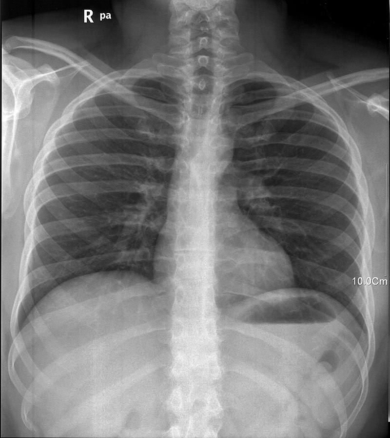
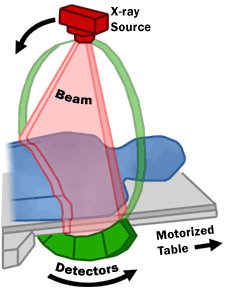
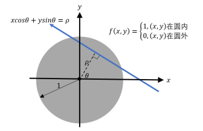

# 《拉东变换的示例与实战》 `2024-09-18`

- 感谢 Aidan 大佬来和我讨论与拉东变换相关的问题，这让我意识到我应该;系统得学习一下傅里叶变换相关的内容。
- 相关链接：https://en.wikipedia.org/wiki/Radon_transform
- 本文试图以一种不那么严谨但可操作的方式从零开始介绍如何对图像进行**拉东变换**以及**逆拉东变换**，本文中不严谨的地方欢迎质疑。

## 背景

- 当今时代，谁还没去过几次医院呢？谁还没做过几次 CT 呢？CT 是 “X射线断层扫描” 的缩写，所以我们先简单感性得聊聊 X 光片是如何制成的。
  - 相关链接：https://en.wikipedia.org/wiki/CT_scan
- 我们可以利用 X 射线对人体不同组织的穿透性，来分析人体内的脏器是否出现了病变。

- 不同组织对于 X 射线的吸收能力也不同，我们用一束平行的 X 射线去照射人的胸部，会得到一张类似上述的图样。图样中每个点的亮度描述的是位于人体与 X 射线光源对侧的接收器上接收到的不同 X 射线光束在经过了人体吸收后的剩余强度。可以明显看到骨骼对 X 射线吸收能力要强于肌肉。
- 但是实际上，在 X 射线光束前进的方向上，等待他的往往不只是一种组织，而是多种组织。因此，在这个方向上我们看到的 X 光照片其实代表了这个方向上 X 射线经过的所有组织对 X 射线阻碍能力在距离上的 “积累”。
- 假设每种组织都有一个阻碍系数，用于描述 X 射线在这种组织中前进单位长度时 X 射线能量上的衰减。那么 X 光照片中每个位置的亮度，就能反映出这个方向上所有组织的阻碍系数叠加（积分）的结果。
- 但是聪明的读者其实马上就会意识到一些问题：CT 作为 X 射线断层扫描，利用的还是 X 射线的穿透能力。但是传统的 X 光照片只能反应人体在一个方向上投影的结果，但 CT 却能画出人体每个截面的扫描图，而不需要真的破坏人体，这让我觉得非常惊奇。

- 那么 CT 是如何分析出人体的每个截面的具体图像的呢？上图展示了 CT 机工作的原理，我们不难想象一个事实：CT 机上获取的原始数据，绝对无法反映出人体某个断层的信息，他能反映的只是人体某个断层在拍扁后的投影信息。而 CT 之所以叫 “Computed Tomography”，也正是因为，它并不是直接把机器拍摄到的 X 射线原始图像直接拿出来给人看，而是通过这些 “**拍扁后的投影信息**”，试图还原出真实的人体截面信息（这里的信息指的就是各个空间位置上对 X 射线的阻碍系数）。
  - 注：上图中的 X-ray Source 以及 Detectors 都可以在轨道上旋转以照射到每个方向。

## 问题引入

- 现在我们一起思考 CT 机能拿到什么数据，以及它如何根据拿到的数据反推回人体的断层信息。

- 我们考虑一个理的情况，假设人体的某个截面是一个圆形，且圆形内的所有位置对 X 射线的阻碍系数为 1，那我们的 CT 机器拿到的原始数据是什么？CT 机的 X 射线源以及 X 射线感光元件能够在 CT 机器的管壁上旋转，因此实际上 CT 机拿到的原始数据，就是上图中，对于任意的 $\rho$ 以及任意的 $\theta$ 确定的每条直线上，人体组织在那条直线上对 X 射线阻碍系数的积分，我们将这个积分的结果记为 $R(\rho, \theta)$。

- 现在我们要问的问题就是，给定 $R(\rho, \theta)$，能否还原回人体组织在每个位置原始的阻碍系数 $f(x, y)$。答案肯定是能，不然医院就不会有带 CT 的放射科了。
- 我们接下来要介绍的内容中基本上可以分为两部分：
  - 拉东变换：也就是已知 $f(x, y)$  的前提下求 $R(\rho, \theta)$ 的过程，这部分现实世界中不需要我们做，CT 机的 X 射线感光元件得到的就是拉东变换后的数据。
  - 逆拉东变换：已知 $R(\rho, \theta)$ 反推回 $f(x, y)$ 的过程，CT 机还原断层数据便是依赖这个原理。
- 其中拉东变换比较好实现，只需要一些基础的图像处理的知识就能实现。由于本文使用的图像都是光栅图而不是矢量图，因此读者可能需要了解常见的光栅图处理的思路，以及双三次插值的相关算法。
- 逆拉东变换的过程需要读者了解傅里叶变换相关的知识才能理解其算法的正确性。不过不用担心，本文会尽可能用通俗的方式介绍这些相关知识。

## 双三次插值

- 未完待续...

## 傅里叶变换

- 未完待续...

## 离散傅里叶变换

- 未完待续...

## 逆拉东变换与离散傅里叶变换

- 未完待续...

## 总结

- 未完待续...

