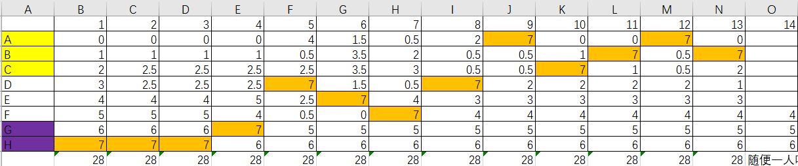
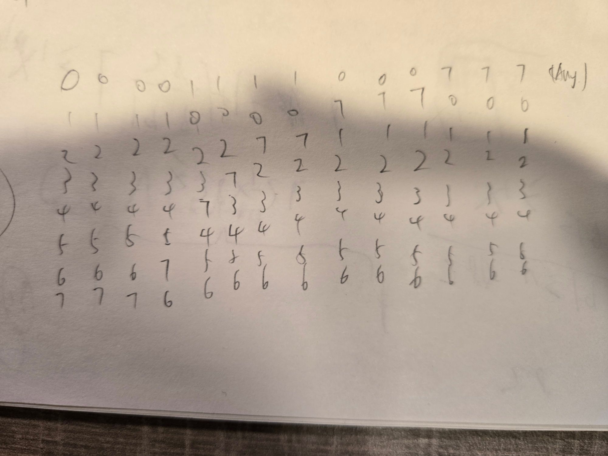

# 《LZS 来问了一个问题》`2024-09-20`

```json
{
    "tags":["math"]
}
```

##  问题描述

- 有 $8$ 个整数类型的变量 $x_1, x_2, \cdots, x_8$。
- 我们要进行若干回合游戏，每回合后，这些变量的值可能发生改变。
- 具体而言：
  - 这些变量中中，将恰有一个变量的值不变。
  - 恰有一个变量的值增加 1。
  - 恰有一个变量的值增加 2。
  - ... 依此类推 ...
  - 恰有一个变量的值增加 7。
- 游戏结束的条件为：
  - 若存在一个变量 $x_i$ 在这一回合前 $x_i\geq 20$ 已经成立。
  - 且在这轮游戏中，$x_i$ 的值恰增加了 7，则游戏在这一回合后结束。
- 问：游戏**至多**能进行多少回合。

## 困难版本

- 在上述问题的基础上，还有一个加难版本的问题。
  - 细心的读者不难猜想到 +0 ~ +7 其实分别对应着某个玩家在游戏中的排名，排名靠前的玩家得分更多。
  - 实际上玩家可以出现排名相同的情况。
- 若有 $k$ 个玩家在某场游戏中排名相同。
  - 他们的分数应该被赋予为他们这些人共享的 “分数区间” 的平均分。
  - 这个平均分应该被累加到玩家对应的计分变量上。
  - 游戏保证：
    - 如果有若干组玩家具有相同的排名。
    - 那么每组组内的玩家数量不会超过四个。
- 在此基础上计算游戏结束所需要的最大回合数。

## 思路

- 我目前没想到什么好思路，打算有灵感时候再看看。
  - 不过我觉得这个问题还蛮有趣的，有空找个搞理论计算机的数学家问问。

## 目前最大回合数

- LZS 目前给出了一种能进行 14 回合的做法。



- cppascalinux 大佬给出了 easy version 的一个 15 会合的做法.


