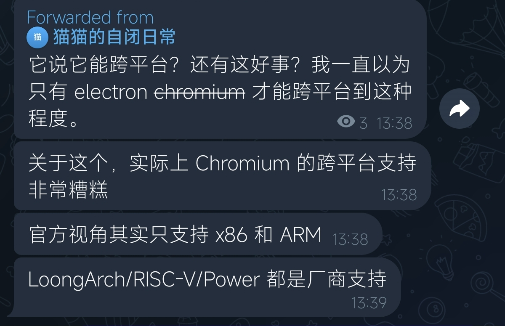

# 《2024 年 10 月公开日志》

- `2024-10-04` 感谢 zkr 大佬给我普及了一下主人奴隶道德学说
  - 参考：https://en.wikipedia.org/wiki/Master%E2%80%93slave_morality
  - zkr 大佬认为，我的道德观念比较接近于奴隶道德，我看了一下感觉说的有道理
- 与 ZKR 关于日常规范的讨论中的一些结论详见：[2024-10-04_zkr-std.md](../../data/misc/2024-10-04_zkr-std.md)
- `2024-10-04` 来自某朋友的朋友圈，我觉得很有道理

- `2024-10-05` 看到了一个很喜欢的视频

> 【给孩子的信：你将在两万天后死去，而在此之前…… | 死亡与游戏的哲思】 https://www.bilibili.com/video/BV1Yzx4eHE1z

- `2024-10-06` 做了一个视频

> 【【PPT 解谜】正则表达式 P1】 https://www.bilibili.com/video/BV1Dt1dYcEiN

- `2024-10-06` 老船长帮我找到了上面的游戏的来源
  - 来源：MIT Mystery Hunt 2013
  - https://puzzles.mit.edu/2013/coinheist.com/rubik/a_regular_crossword/grid.pdf
  - https://regexcrossword.com/
  - https://en.wikipedia.org/wiki/Puzzle_hunt
- `2024-10-06` 为自己的公开日志制作了一个 offcanvas 的目录，但现在效果还不是很好，以后再修理吧。
  - 现在还有一个亟待解决的问题就是表格太丑陋，图片太唐突。
  - 要支持检索功能，最好做成纯 js 的，后端依赖实在不是一个好东西。
- `2024-10-06` 基于画师 `Ravimo` 画的 Arch 娘的图制作了一个 `1920x1080` 的桌面壁纸，并把它集成到了我的日历生成器中。
  - 详见：[2024-10-06_arch-musume.png](../../blob/img/2024-10-06_arch-musume.png)
- `2024-10-07` 为我的脚本管理器 `neko` 增加了一个 `sub_clone` 脚本，用于 `clone` 一些子项目。
- `2024-10-08` 谢天谢地今天仍然放假，让我补了一觉，但是明天还有组会，而我还什么都没干，终究是个不眠之夜。
- `2024-10-09` 尽管我看到了组会取消的通知，由于 PTSD，我还是去了线下试图参加组会。
  - 我现在真觉得我应该退一个学了，我的身心健康已经严重受到了上学的影响。

- `2024-10-09` 听说宁夏理工要举办安同校园行。
- `2024-10-09` 升级了动漫列表工具，使用 `pydoc + less -R` 实现分页。
- `2024-10-12` 实现了一个用于将大文件拆分成小文件的 `python` 包。
  - https://github.com/GGN-2015/cuffers/
- `2024-10-12` 实现了一个用于向服务器发送远程命令的 `python` 包。
  - https://github.com/GGN-2015/rexec
- `2024-10-12` 实现了一个 `python` 包，能用于多线程加速一些简单的任务。
  - https://github.com/GGN-2015/mptrolley
- `2024-10-12` 感动，我活了这么多年，终于学会怎么写 `python` 包并上传 `pypi` 了，原来这么简单的吗。。。
  - https://pypi.org/user/GGN_2015/
- `2024-10-13` 关于我耳机左耳没声怎么解决：别插太深好像左耳就有声了。
- `2024-10-13` 打算给 `neko` 工具写一个使用手册，不然我之后估计真的有一天会忘了自己做的工具怎么用。
- `2024-10-16` 今天突然想到可以把我的日志接入 GPT 从而实现一个我自己的生活个人语音助手，感觉会非常有趣。
  - 可以搞一个 AI 配音之类的，然后配置这个语音助手，想想都可爱。
  - 然后我可以问它日志中的内容，然后她回去做相关性检索，然后给我汇报我想要的答案是什么。
  - 我觉得这个东西我在技术上完全能实现。
- `2024-10-16` 啊啊啊啊，今天还有组会，我 PPT 还没做。
  - 注：今天的组会要在 G712 开，所以最好早点去。
- `2024-10-16` 整理了所有课程的课件。
- `2024-10-19` 和 WWD 一起配 NVIDIA 的驱动。

