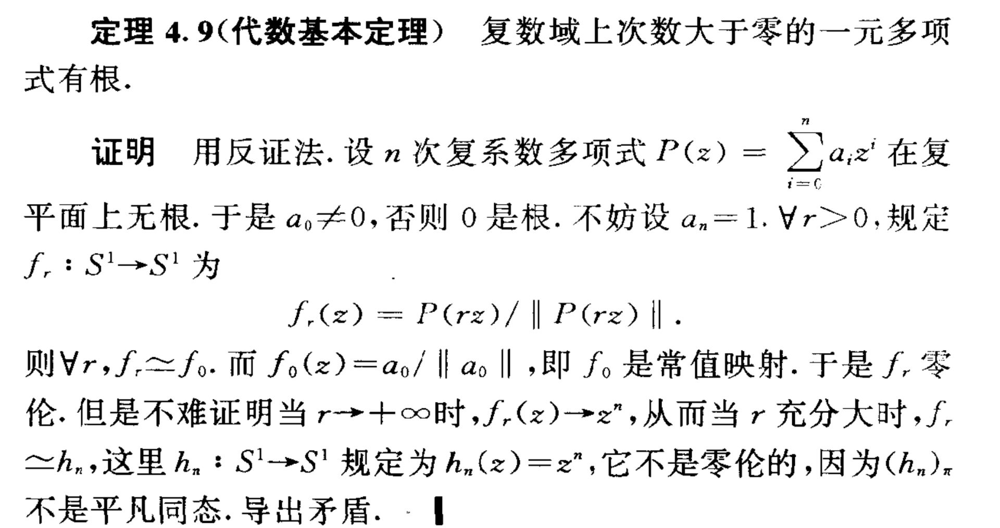

# 《2024 年 11 月公开日志》

- `2024-11-02` 和队友一起做计算机网络的在线实验，我只能说这个在线实验平台真的好灵车。
  - `minicom` 日常连不上，虚拟机自动重启导致配置丢失，自闭。
  - 我们似乎唯一能做的只有，重新预约，换机器，试试别的机器能不能正常使用。
- `2024-11-03` 参加了实验室迎新团建。
- `2024-11-03` 更新后 nvidia 包似乎出了一些意想不到的问题，回忆一下社区同仁提到的查错方式。
  - 先试试 tty 能不能用，不用急着进入 livecd：~~我这个 N 卡电脑就不用想了，因为正常情况下 tty 也用不了~~。
  - 进入 livecd 并完成挂载以及 `arch-chroot`：
    - `journalctl -b -1`
    - 检查 `/var/log/Xorg.0.log` 中的内容
    - `dkms status`
  - 最后是如何解决的：`oma --no-check-dbus install nvidia --reinstall `
- `2024-11-03` 如果哪天老船长忘记了初心，要记得做一个两个小时的视频去把它打醒
  - https://www.youtube.com/watch?v=Ftk5xMeJito
- `2024-11-03` 收到了 cppascalinux 大佬的 galgame 礼物，有空去玩一下
- `2024-11-04` 关于代数基本定理的证明

- `2024-11-05` 突然想到一个暴论，不过我觉得不无道理甚至可能可以沿着这个话题继续思考
  - 任何体系结构研究归根结底都是**意识形态**研究：面向应用的体系结构优化本质上是在试图理解需求，而需求归根结底来自于 “人的需求”

- `2024-11-05` 关于新生登记表填写

> @所有人 【硕士研究生登记表收集】预计本周日之前需要收取开学发的研究生登记表，请各位同学及时填写表中相关内容。具体的提交时间地点后续通知
>
> 【研究生登记表填写收取】
>     登记表已交至各班发放给大家，若期间遗失的同学可于5号公寓地下超市打印店打印。
>     请查看模版认真填写，若在填写过程中有其他疑问，可填写至共享文档中，会定期统一回复。

- `2024-11-07` 参加了科技写作课的虚拟会议，感受是，我做的 poster 真差劲：
  - 以后如果要是再做 poster 一定不要放大段的文字，没意义，**只放图和图片的解释就好**。
  - 反观那个 spotlight 的 ppt 我感觉第二页做的就比第三页好。
  - 能放图不放表。
- `2024-11-09` 晚上十一点半和 SFK 出去吃包子，结果没开门，问了一下发现他们包子铺每天晚上一点才开门。
- `2024-11-09` 去西单大悦城买了不少芙莉莲周边。
- `2024-11-09` zkr 大佬说昨天晚上做梦梦到曹操被苦力怕炸死。
- `2024-11-10` adipy 大佬昨天提到了我过去构思的小说，但是我现在已经完全没有动力写下去了，自闭。
  - 感觉我已经失去当时的想象力了。

