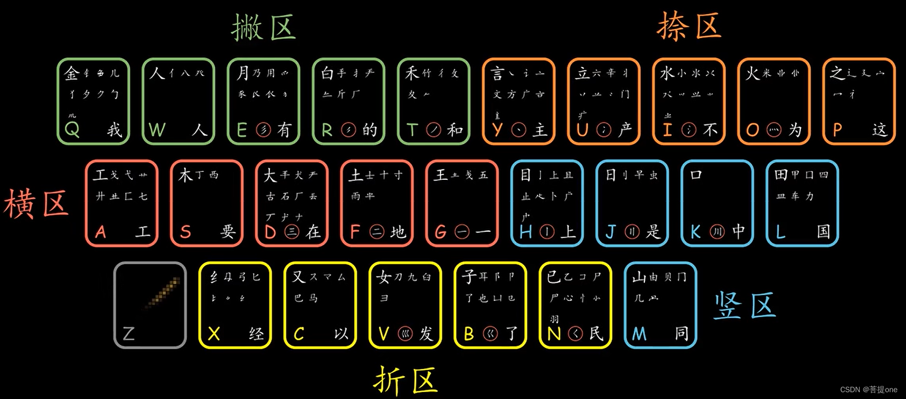

# 《五笔学习》`2024-10-10`

- 这个视频真的神了，我打算记一波笔记。

> 【【manim】20分钟入门五笔输入法】 https://www.bilibili.com/video/BV1gK4y1H7rr

- 看到一篇文章，感觉估计是从同一个视频记的笔记

> 【总结：86版五笔输入法】https://blog.csdn.net/qq_45586218/article/details/127327259

- `2024-10-10` `GGN_2015` 目前使用（微软/搜狗）双拼作为主要的输入方式，`GGN_2015` 希望能有生之年学习一下五笔。

- “五笔” 是哪 “五” 笔：横竖撇捺（点）折
  - 根据所有偏旁部首的前两笔，将这些偏旁部首拆分为 25 个等价类
  - 然后再为了打字方便，对上述的 25 个等价类进行了必要的调整，使得
    - 没有空的等价类
    - 便于刻画首笔重复的差异性
    - 便于刻画形相结构的差异性
    - 同源字根或者长得比较接近的字根合并入同一等价类

- 键盘分区：
  - 横区：GFDSA
  - 竖区：HJKLM
  - 撇区：TREWQ
  - 捺区：YUIOP
  - 折区：NBVCX
  - 万能键：Z

- 五笔字根周期表：

- 字根周期表的组成部分
  - 键名汉字：左上角的大字
  - 重复笔画字根：笔画简单重复所构成的字根
  - 一级简码汉字：右下角的汉字（一般不能作为字根，除非本身就是字根）

- 输入分类：
  - 键名汉字：（左上角）连按四下同一个键
  - 键面汉字：（单独成字的字根）先按所在的分区，然后用 GHTYN 去 “写” 这个字（第一笔、第二笔、最后一笔，必要时补 LL）
  - 键外汉字：（键盘上没有的汉字）

