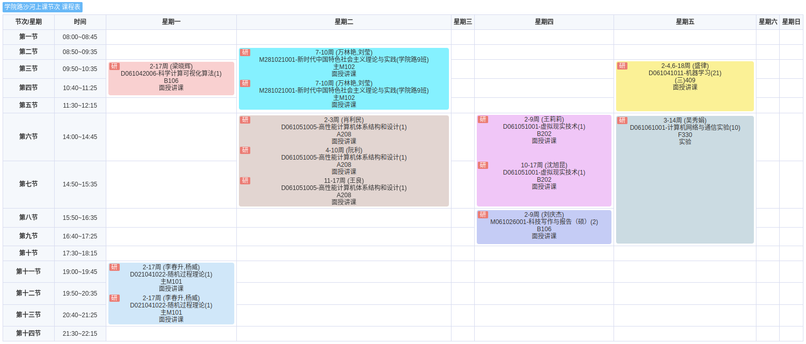

# 1.2.2 课程列表

## 0. 规则

1. 填写顺序：
   1. 此文档应当按照时间顺序，从前向后编排。

## 1. 2024 年秋季课程

| 课程名称                   | 存档链接                                                | 备注       |
| -------------------------- | ------------------------------------------------------- | ---------- |
| 科学计算可视化             | [data/2024a-visc](../data/2024a-visc/README.md)         |            |
| ~~网络与信息安全~~         | ~~[data/2024a-netsec](../data/2024a-netsec/README.md)~~ | 已退课     |
| 随机过程理论               | [data/2024a-rand](../data/2024a-rand/README.md)         | 听说比较难 |
| 高性能计算机体系结构和设计 | [data/2024a-hpcs](../data/2024a-hpcs/README.md)         |            |
| 计算机网络与通信实验       | [data/2024a-netexp](../data/2024a-netexp/README.md)     |            |
| 虚拟现实技术               | [data/2024a-vr](../data/2024a-vr/README.md)             |            |
| 科技写作与报告             | [data/2024a-engwri](../data/2024a-engwri/README.md)     |            |
| 机器学习                   | [data/2024a-ml](../data/2024a-ml/README.md)             |            |

